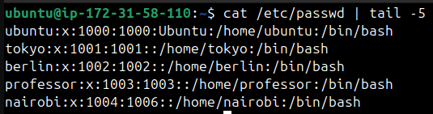
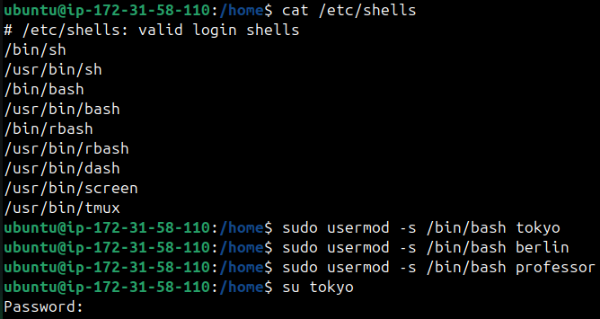
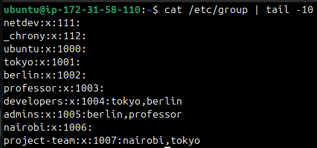
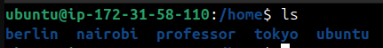
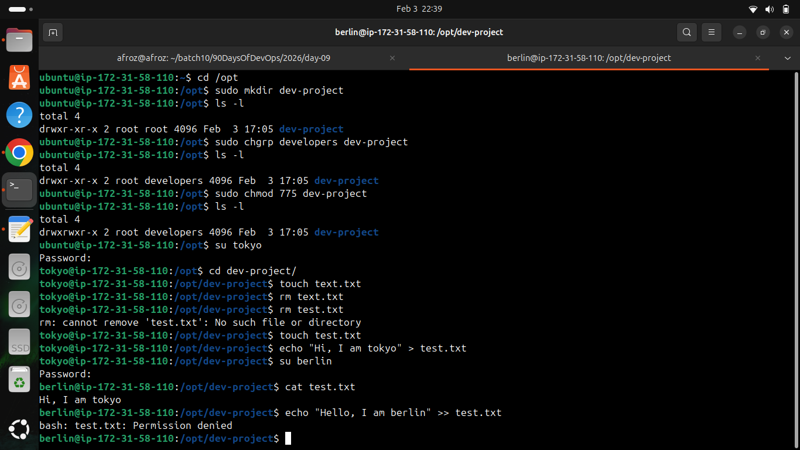
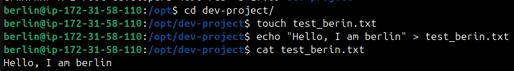
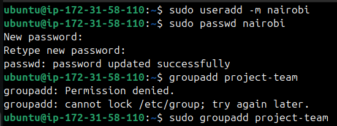
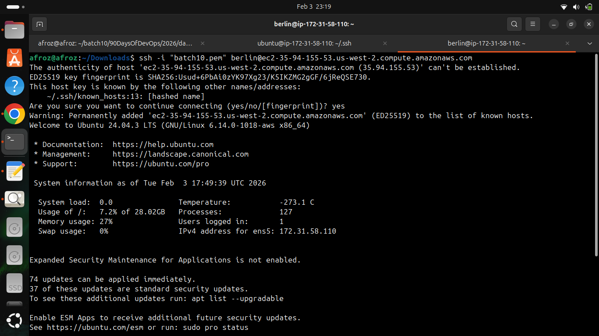

# Linux User & Group Management

## Users Created

` useradd -m username`

- Users: tokyo, berlin, professor, nairobi

## Groups Created

`groupadd groupname`

- Groups: developers, admins, project-team

## Changed default shell to /bin/bash

`sudo usermod -s /bin/bash username`

## Group Assignment

## Directories Created

## Home directories of Users

## Shared Directory

1- Create directory: /opt/dev-project
2- Set group owner to developers
3- Set permissions to 775 (rwxrwxr-x)
4- Test by creating files as tokyo and berlin

 Set password for user

## Team Workspace

1- Create user nairobi with home directory
2- Create group project-team
3- Add nairobi and tokyo to project-team
4- Create /opt/team-workspace directory
5- Set group to project-team, permissions to 775
6- Test by creating file as nairobi

## Commands Used

* `useradd -m uname` - Add user with default directory
* `sudo passwd uname` - Set password for user
* `groupadd gname` - Add group
* `sudo usermod -s /bin/bash username` - Change shell
* `sudo usermod -aG group user` - Assign user to group
* `sudo chgrp new_group directory/file ` - Change group ownership of a directory or file
* `sudo chmod 775 file/directory` - Change permissions of a file or directory

## How to login using created users

### Example : Login as Berlin User

* Create .ssh directory for user "berlin" - `sudo mkdir -p /home/berlin/.ssh`
    
* Copied Authorized keys from user ubuntu to berlin - `sudo cp /home/ubuntu/.ssh/authorized_keys /home/berlin/.ssh`
    
* Change the ownership of .ssh and authorized keys - `sudo chown -R berlin:berlin /home/berlin/.ssh`

* Changed permissions for .ssh and authorized keys - 
    `sudo chmod 700 /home/berlin/.ssh`
    `sudo chmod 600 /home/berlin/.ssh/authorized_keys`

* Login - `ssh -i "batch10.pem" berlin@ec2-35-94-155-53.us-west-2.compute.amazonaws.com`

## What I Learned

* Gained a clear understanding of how users and groups work in Linux.
* Practiced managing permissions and observed their impact on collaboration.
* Even if two users belong to the same group and share access to a directory, they cannot automatically write to or modify each other’s files. By default, when a user creates a file inside a directory:
  -The file is owned by the user and their primary group (not necessarily the directory’s group).
  -The default file permissions usually give write access only to the owner, while the group gets read access.
  -As a result, other group members can view the file but cannot edit or delete it.
  Example : Shared directory scenario.
* Set up direct login access for newly created users using SSH keys and proper permissions.
