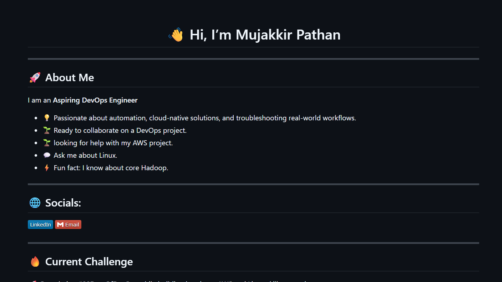
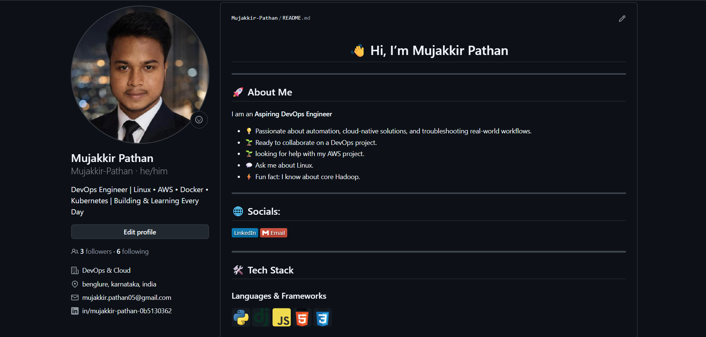

# Day 27 – GitHub Profile Makeover: Build Your Developer Identity

## Overview

Today I focused on improving my GitHub profile and organizing my repositories to create a professional developer portfolio. The goal was to make my profile easier for recruiters, hiring managers, and fellow developers to understand.

---

## Task 1: GitHub Profile Audit

Before making changes, I reviewed my GitHub profile from a recruiter's perspective.

### Initial Observations

* Updated and reviewed profile information.
* Improved my bio to clearly reflect my interest in DevOps and Cloud technologies.
* Reviewed pinned repositories to ensure they showcase relevant work.
* Checked repository descriptions and README files.
* Ensured visitors can easily understand what I am currently learning and building.

---

## Task 2: Created Profile README

Created a special GitHub profile repository using my GitHub username.

### Added Information

* Personal introduction
* Current learning journey (90 Days of DevOps)
* Skills and technologies

  * Linux
  * Git & GitHub
  * Shell Scripting
  * Python
  * Docker
  * AWS (Learning)
* Featured repositories
* LinkedIn profile link
* Contact information

### Screenshot

**Profile README Screenshot**

---

## Task 3: Repository Organization

Reviewed and organized repositories for better structure and readability.

### 90 Days of DevOps

Improvements:

* Added repository description
* Organized submissions by day
* Improved README structure
* Added learning progress tracking

### Shell Scripts Repository

Improvements:

* Added shell scripts from Days 16–21
* Created detailed README
* Added script descriptions

### Python Scripts Repository

Improvements:

* Added Python practice projects
* Documented each script
* Organized files properly

### DevOps Notes Repository

Added:

* Git command references
* Shell scripting cheat sheet
* Learning notes and documentation
* Topic-wise organization

---

## Task 4: Pinned Best Repositories

Selected repositories that best represent my learning journey and technical skills.

Pinned repositories include:

1. 90 Days of DevOps
2. Shell Scripts
3. Python Scripts
4. DevOps Notes
5. Docker Learning Repository
6. Linux Practice Repository

---

## Task 5: Repository Cleanup

Completed the following cleanup activities:

* Reviewed repository names
* Improved repository descriptions
* Updated README files
* Removed unnecessary content
* Verified that no sensitive information was exposed
* Checked for API keys, passwords, and environment files

---

## Task 6: Before & After Comparison

### Before

Insert GitHub profile screenshot before changes.

forgot to take 

### After

Insert GitHub profile screenshot after changes.

---

## Three Major Improvements

### 1. Professional GitHub Identity

Improved profile bio, profile README, and overall presentation so visitors can immediately understand my interests and learning path.

### 2. Better Repository Organization

Added proper descriptions, READMEs, and structure to repositories, making projects easier to navigate and understand.

### 3. Recruiter-Friendly Portfolio

Pinned the most relevant repositories and highlighted ongoing DevOps learning efforts to create a stronger first impression.

---

## Key Takeaways

* GitHub is more than a code hosting platform; it serves as a professional portfolio.
* Well-documented repositories improve project visibility and credibility.
* A strong profile README helps communicate skills, goals, and ongoing work effectively.

