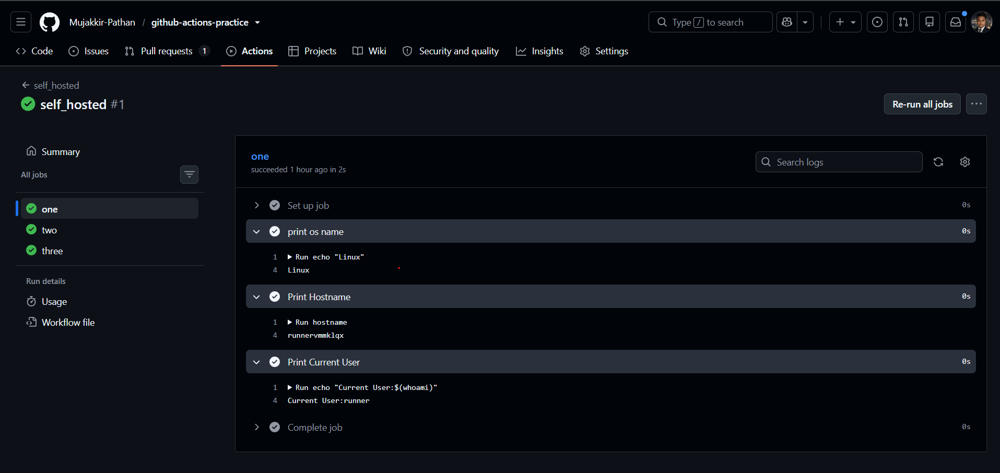
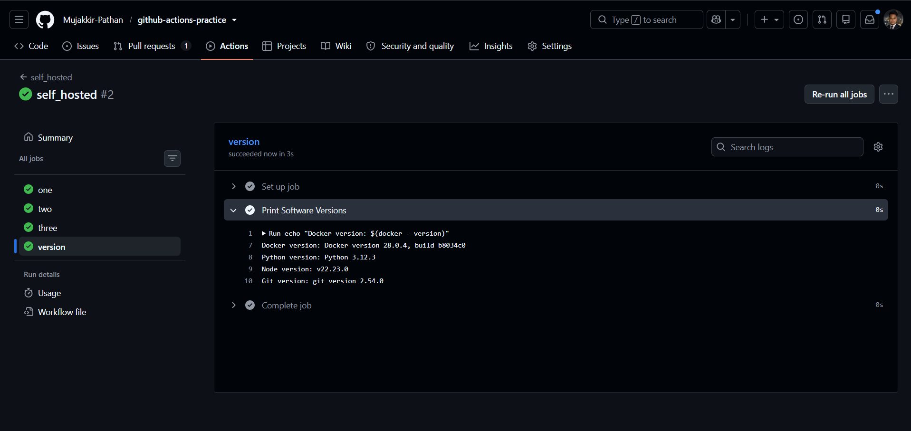
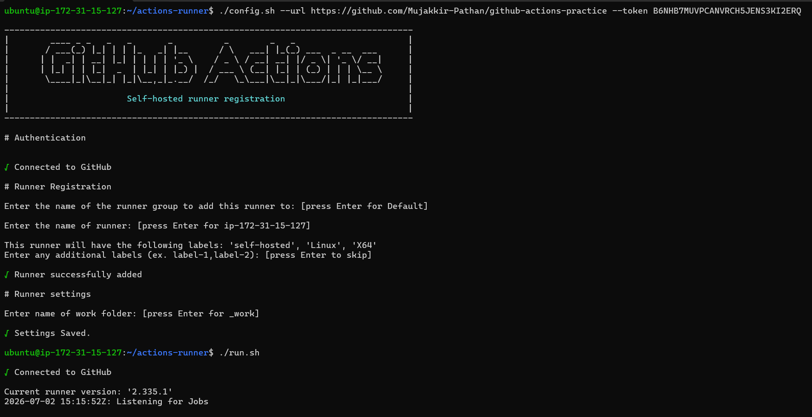
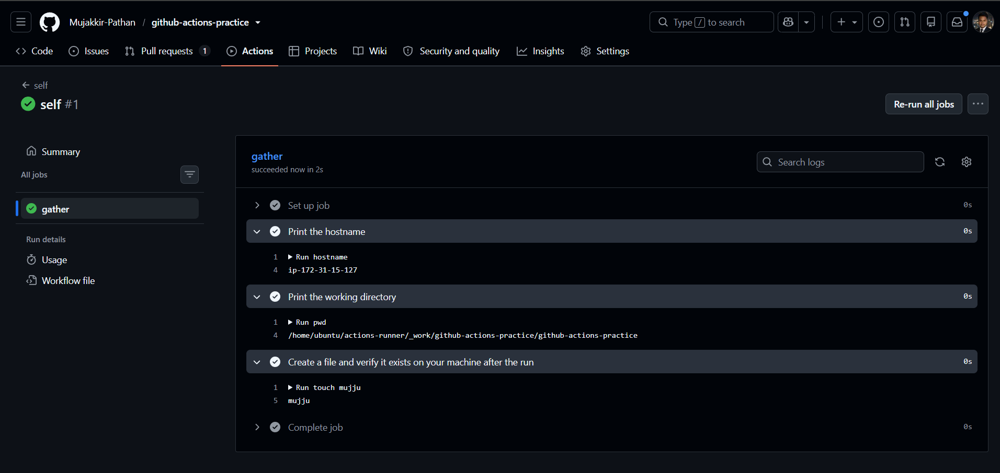

# Day 42 - GitHub Actions Runners (GitHub-Hosted & Self-Hosted)

## Objective

Learn the difference between GitHub-hosted and self-hosted runners, configure a self-hosted runner, and execute workflows on both types of runners.

---

yaml files created in the task:

1.[github-hosted-runners.yml](https://github.com/Mujakkir-Pathan/github-actions-practice/blob/main/.github/workflows/github-hosted-runners.yml).

2.[self-hosted.yml](https://github.com/Mujakkir-Pathan/github-actions-practice/blob/main/.github/workflows/self-hosted.yml).

---

# Task 1: GitHub-Hosted Runners

### Completed

Created a workflow with three jobs running on different GitHub-hosted runners:

- Ubuntu (`ubuntu-latest`)
- Windows (`windows-latest`)
- macOS (`macos-latest`)

Each job printed:

- Operating System
- Runner Hostname
- Current User

Verified that all three jobs executed successfully in parallel.



---

# Task 2: Explore What's Pre-installed

### Completed

Created a job on the Ubuntu runner to print the versions of pre-installed software.

Verified the following tools were already available:

- Docker
- Python
- Node.js
- Git

Observed that GitHub-hosted runners already include commonly used development tools, reducing workflow setup time.



---

# Task 3: Set Up a Self-Hosted Runner

### Completed

Configured a self-hosted runner on an AWS EC2 Ubuntu instance.

Completed the following:

- Registered the runner with the GitHub repository
- Started the runner
- Verified the runner appeared in **Settings → Actions → Runners**
- Confirmed the runner was online and ready to receive jobs



---

# Task 4: Use the Self-Hosted Runner

### Completed

Created a workflow using:

```yaml
runs-on: self-hosted
```

The workflow performed the following:

- Printed the hostname of the EC2 instance
- Printed the current working directory
- Created a file (`mujju`)
- Verified the file existed on the self-hosted runner after execution

Confirmed that the workflow executed on the EC2 machine instead of a GitHub-hosted runner.



---

# Task 5: Runner Labels

### Completed

Added a custom label to the self-hosted runner.

Updated the workflow to target the runner using:

```yaml
runs-on: [self-hosted, my-linux-runner]
```

Triggered the workflow and verified that the job was successfully picked up by the labeled self-hosted runner.

---

# Notes

## What is a GitHub-hosted runner?

A GitHub-hosted runner is a virtual machine provided and managed by GitHub to execute GitHub Actions workflows. GitHub provisions, maintains, and cleans up the runner automatically after every job.

---

## Why do pre-installed tools matter?

GitHub-hosted runners already include common development tools such as Docker, Git, Python, and Node.js.

This helps by:

- Reducing workflow execution time
- Eliminating repetitive installation steps
- Making CI/CD pipelines simpler and more reliable

---

## Why are labels useful?

Labels allow workflows to target specific self-hosted runners.

They are useful when multiple runners have different:

- Operating systems
- Hardware configurations
- Installed software
- Intended workloads

---

# GitHub-Hosted vs Self-Hosted

| Feature | GitHub-Hosted | Self-Hosted |
|----------|---------------|-------------|
| **Who manages it?** | GitHub | You or your organization |
| **Cost** | Uses GitHub Actions minutes | You pay for and manage the infrastructure |
| **Pre-installed tools** | Many tools are already installed | You install and maintain all required software |
| **Good for** | General CI/CD workloads and quick setup | Custom environments, private networks, specialized hardware |
| **Security concern** | Runs on GitHub-managed infrastructure | You are responsible for securing and maintaining the runner |

---

# Outcome

Successfully learned:

- GitHub-hosted runners
- Parallel execution across multiple operating systems
- Pre-installed software on GitHub runners
- Setting up a self-hosted runner on AWS EC2
- Running workflows on self-hosted infrastructure
- Using runner labels to target specific runners
- Differences between GitHub-hosted and self-hosted runners
