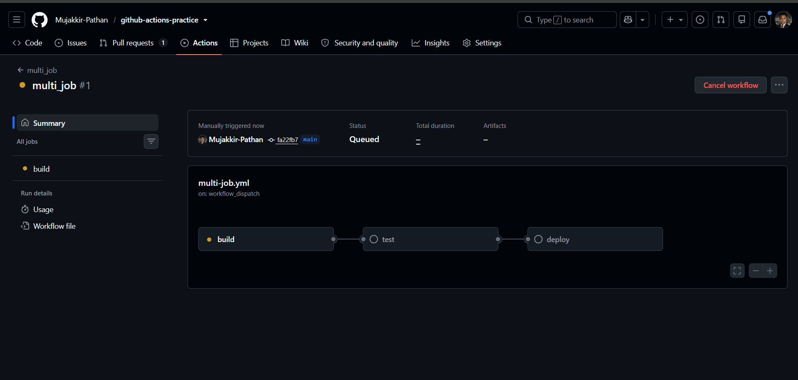
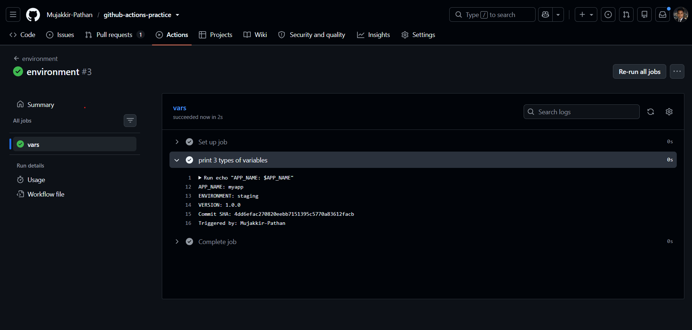
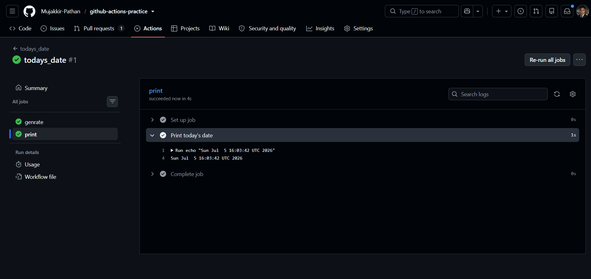
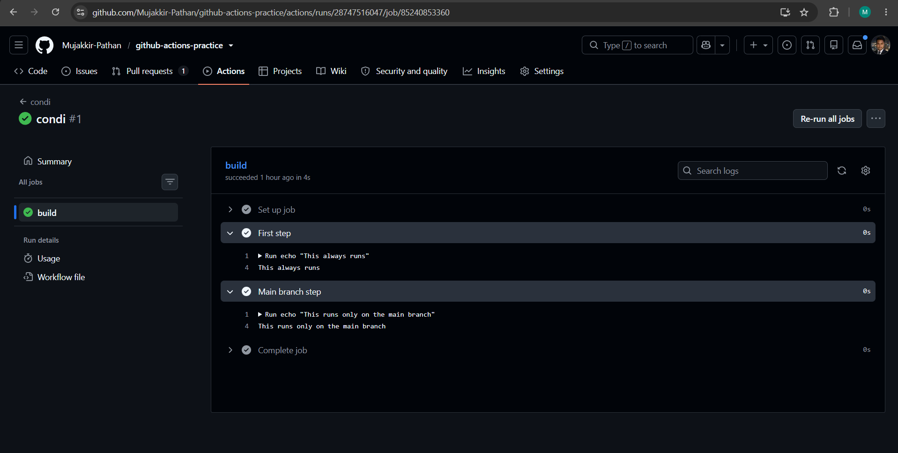
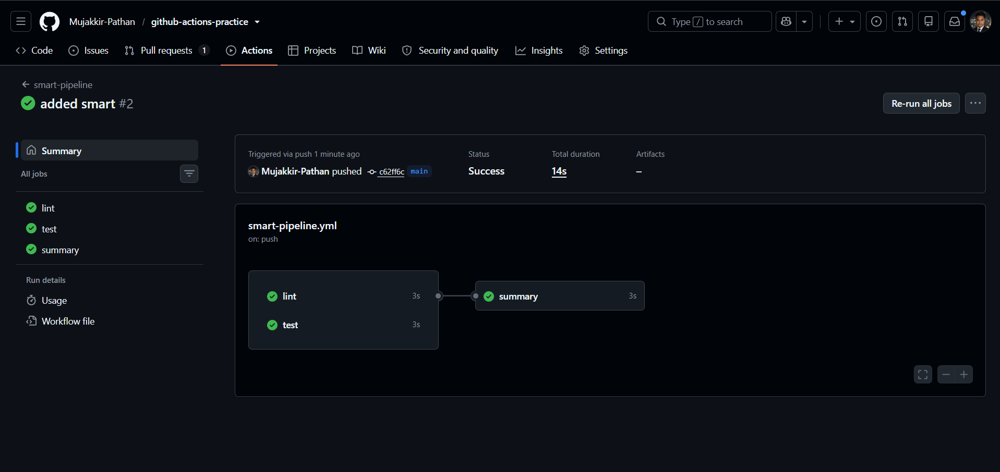

# Day 43 – Jobs, Steps, Env Vars & Conditionals

## Overview

Today I learned how to control GitHub Actions workflows using jobs, steps, environment variables, outputs, and conditionals.

---

# Task 1: Multi-Job Workflow

## What I did

Created a workflow with 3 jobs:

- build
- test
- deploy

Used `needs` to control execution order.

[multi-job.yml](https://github.com/Mujakkir-Pathan/github-actions-practice/blob/main/.github/workflows/multi-job.yml)

## Learning

- Jobs run in parallel by default.
- `needs` creates a dependency chain.
- Helps control workflow execution order.

---

# Task 2: Environment Variables

## What I did

Used environment variables at three levels:

- Workflow level
- Job level
- Step level

Also used GitHub context variables.

[environment-vars.yml](https://github.com/Mujakkir-Pathan/github-actions-practice/blob/main/.github/workflows/environment-vars.yml)

## Learning

- Multiple levels of environment variables exist.
- Step > Job > Workflow precedence.
- GitHub context provides runtime metadata.

---

# Task 3: Job Outputs

## What I did

Passed data between jobs using outputs.

[job-outputs.yml](https://github.com/Mujakkir-Pathan/github-actions-practice/blob/main/.github/workflows/job-outputs.yml)

## Learning

- Jobs are isolated environments.
- Outputs allow communication between jobs.
- `needs.<job>.outputs` is used to access values.

---

# Task 4: Conditionals

## What I did

Used conditional execution in steps and jobs:

- Branch-based execution
- Failure-based execution
- Event-based execution
- `continue-on-error`

## Learning

- `if` controls execution flow.
- GitHub supports branch-based logic.
- Failure conditions help debugging.
- Jobs can be event-specific.

---

# Task 5: Smart Pipeline

## What I did

Built a full CI pipeline:

- `lint` and `test` run in parallel.
- `summary` runs after both.
- Branch detection.
- Commit message printing.

[smart-pipeline.yml](https://github.com/Mujakkir-Pathan/github-actions-practice/blob/main/.github/workflows/smart-pipeline.yml)

## Learning

- Real CI pipelines use multiple jobs.
- `needs` controls execution flow.
- GitHub context enables dynamic workflows.

---

# Final Summary

Today I learned:

- Multi-job workflows
- Environment variables
- Job outputs
- Conditional execution
- CI pipeline orchestration
