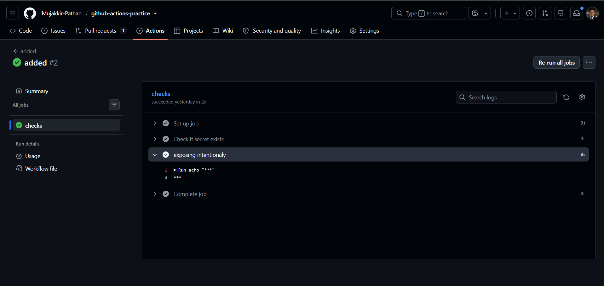
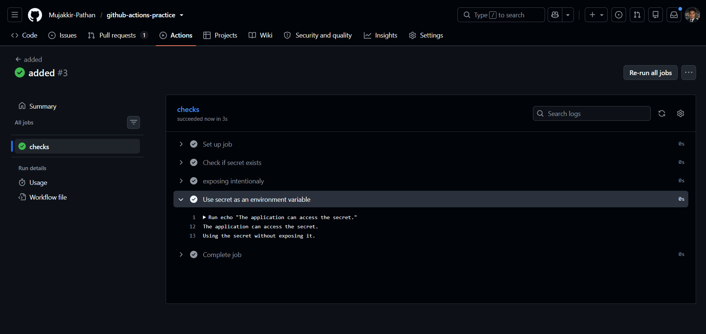
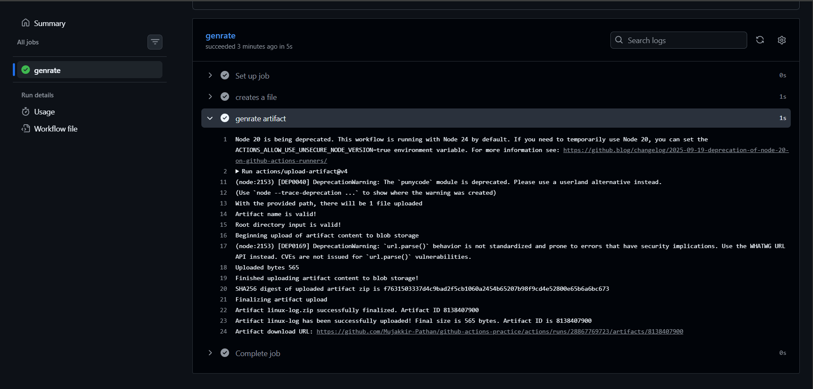
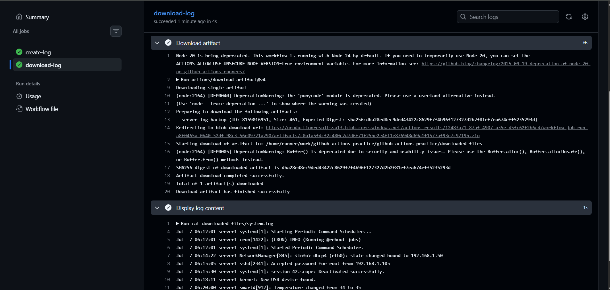
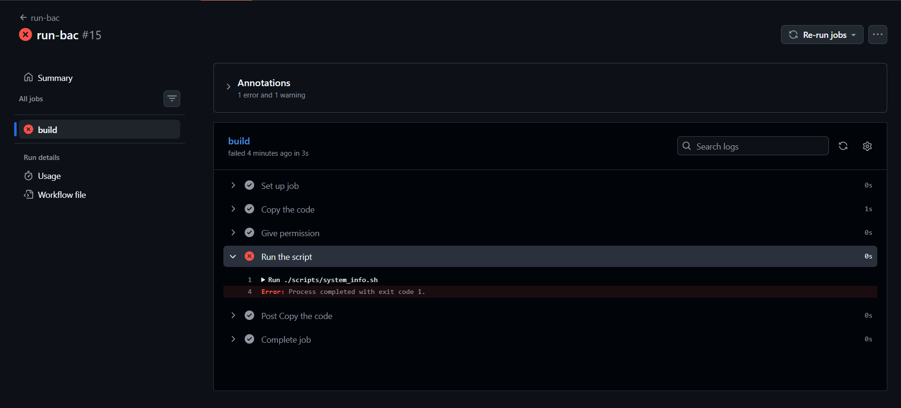
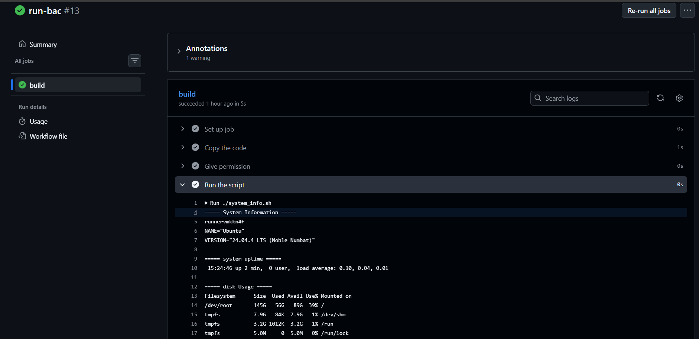
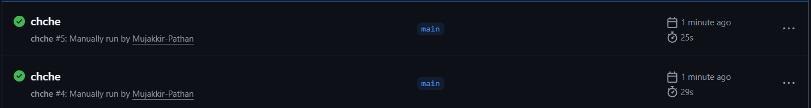

# Day 45 – Secrets, Artifacts, Real CI Testing & Caching

## Overview

Today I learned how GitHub Actions securely manages sensitive information, shares files between jobs using artifacts, executes real scripts in a CI pipeline, validates workflow failures, and improves workflow performance using dependency caching.

---

files created:- 1.[sect.yml](https://github.com/Mujakkir-Pathan/github-actions-practice/blob/main/.github/workflows/sect.yml).
                2.[generate.yml](https://github.com/Mujakkir-Pathan/github-actions-practice/blob/main/.github/workflows/generate.yml).
                3.[run-backup.yml](https://github.com/Mujakkir-Pathan/github-actions-practice/blob/main/.github/workflows/run-backup.yml).
                4.[chche.yml](https://github.com/Mujakkir-Pathan/github-actions-practice/blob/main/.github/workflows/chche.yml)

---

# Task 1: GitHub Secrets

## Overview of what I did

- Created a repository secret named `MY_SECRET_MESSAGE`.
- Wrote a workflow to verify whether the secret exists.
- Passed the secret as an environment variable.
- Verified that GitHub masks secret values in workflow logs.

## What I Learned

- How to securely store sensitive information in GitHub.
- Why secrets should never be hardcoded.
- GitHub automatically masks secret values in logs.
- Secrets can be safely accessed using environment variables.

---

# Task 2: Using Secrets as Environment Variables

## Overview of what I did

- Used `MY_SECRET_MESSAGE` as an environment variable inside the workflow.
- Verified that the application could access the secret without exposing its value.
- Added additional repository secrets:
  - `DOCKER_USERNAME`
  - `DOCKER_TOKEN`

## What I Learned

- How to use secrets securely inside workflow steps.
- Why environment variables are the preferred way to access secrets.
- How GitHub protects sensitive information during workflow execution.

---

# Task 3: Upload Artifacts

## Overview of what I did

- Created a log file named `system.log`.
- Uploaded the file as a GitHub Actions artifact.
- Downloaded the artifact from the Actions page after workflow completion.

## What I Learned

- How GitHub Actions stores workflow-generated files.
- Why artifacts are useful for debugging and reporting.
- Artifacts remain available after workflow execution.

---

# Task 4: Download Artifacts Between Jobs

## Overview of what I did

- Created a workflow with two jobs.
- First job generated and uploaded `system.log`.
- Second job downloaded the artifact.
- Displayed the contents of the downloaded log file.

## What I Learned

- Jobs do not automatically share files.
- Artifacts make file sharing between jobs possible.
- `needs` controls job execution order and dependencies.

---

# Task 5: Run Real Tests in CI

## Overview of what I did

- Added my shell script (`scripts/system_info.sh`) to the repository.
- Created a workflow to execute the script.
- Granted execute permission before running it.
- Successfully executed the script inside GitHub Actions.
- Intentionally modified the script to fail.
- Verified that the workflow turned red.
- Fixed the script and verified that the workflow turned green again.
- Workflow turned green again after fixing the script.

## What I Learned

- How to execute real shell scripts in GitHub Actions.
- Why Linux scripts require execute permission.
- How exit codes control workflow success and failure.
- CI pipelines automatically fail when scripts return non-zero exit codes.
- Fixing the underlying issue restores a successful pipeline.

---

# Task 6: Caching

## Overview of what I did

- Created a workflow that installs Python dependencies.
- Configured dependency caching using `actions/cache`.
- Cached the pip download directory.
- Executed the workflow twice.
- Compared the execution time between both runs.

## What I Learned

- How `actions/cache` improves GitHub Actions performance.
- What information is stored inside the cache.
- How cache keys determine when a cache is reused or recreated.
- Why dependency caching significantly reduces workflow execution time.
- The pip cache directory (`~/.cache/pip`) is cached and stored by GitHub for future workflow runs.

---

# Summary

By completing Day 45, I learned how to:

- Securely manage secrets in GitHub Actions.
- Access secrets safely using environment variables.
- Upload and download workflow artifacts.
- Share files between multiple jobs.
- Execute real shell scripts inside CI pipelines.
- Understand how exit codes affect workflow status.
- Simulate workflow failures and verify successful fixes.
- Improve workflow performance using dependency caching.
- Understand what is cached, where it is stored, and how GitHub restores cached dependencies.
