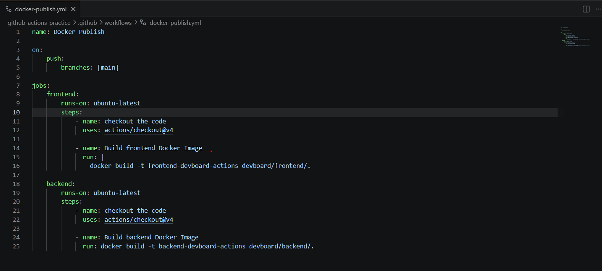
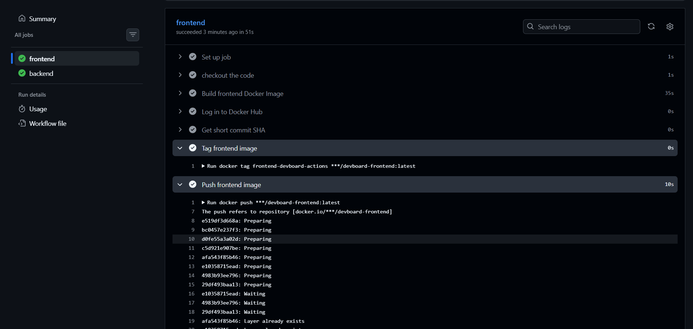
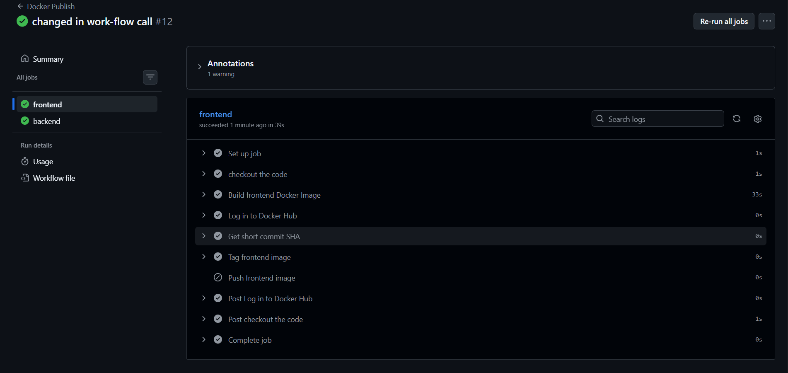
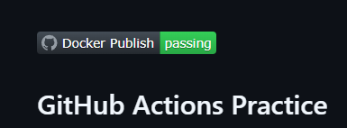

# Day 45 – Docker Build & Push in GitHub Actions

## Overview

Today I built a complete CI/CD pipeline using GitHub Actions that automatically builds Docker images and pushes them to Docker Hub. I also configured the workflow to push images only from the `main` branch, added a workflow status badge to the repository, and verified the complete workflow.

---

# Task 1: Prepare

## What I did

- Used the DevBoard application I Dockerized earlier.
- Added the project to the `github-actions-practice` repository.
- Verified that the required `Dockerfile` files were available.
- Verified that the `DOCKER_USERNAME` and `DOCKER_TOKEN` GitHub Secrets were configured.

---

# Task 2: Build the Docker Image in CI

## What I did

- Created `.github/workflows/docker-publish.yml`.
- Configured the workflow to trigger on GitHub pushes.
- Checked out the repository.
- Built separate Docker images for the frontend and backend applications.

[docker-publish.yml](https://github.com/Mujakkir-Pathan/github-actions-practice/blob/main/.github/workflows/docker-publish.yml)

---

# Task 3: Push to Docker Hub

## What I did

- Logged in to Docker Hub using GitHub Secrets.
- Generated a short commit SHA.
- Tagged both frontend and backend images with:
  - `latest`
  - `sha-<short-commit-hash>`
- Pushed both image tags to Docker Hub.

## Verification

- Verified that both repositories on Docker Hub contained the `latest` and `sha-<short-commit-hash>` tags.

---

# Task 4: Only Push on Main

## What I did

- Configured the workflow to run on every push.
- Added conditions so the Docker push steps execute only when the branch is `main`.

## Verification

- Verified that on a feature branch the workflow built the images but skipped the push steps.
- Verified that on the `main` branch the workflow built and pushed the images successfully.

---

# Task 5: Add a Status Badge

## What I did

- Added the Docker Publish workflow status badge to the repository `README.md`.

## Verification

- Verified that the badge appeared in the README and displayed the workflow status.

---

# Task 6: Pull and Run It

## What I did

- Pulled the Docker images from Docker Hub.
- Ran the Docker images successfully.

[dockerhub link](https://hub.docker.com/repositories/mujakkirpathan)

### Full Journey

1. Pushed code to GitHub.
2. GitHub Actions triggered the workflow.
3. The repository was checked out.
4. Docker images were built.
5. GitHub Actions logged in to Docker Hub.
6. Images were tagged with `latest` and `sha-<short-commit-hash>`.
7. Images were pushed to Docker Hub.
8. Docker pulled the images.
9. Docker created and started the containers.

## Verification

- Verified that the images were successfully pulled from Docker Hub and the containers started successfully.
