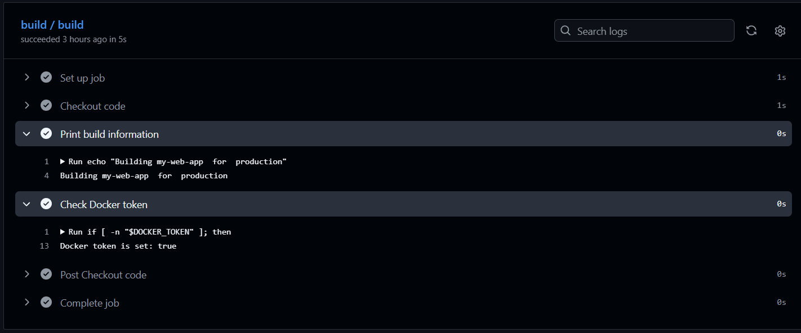
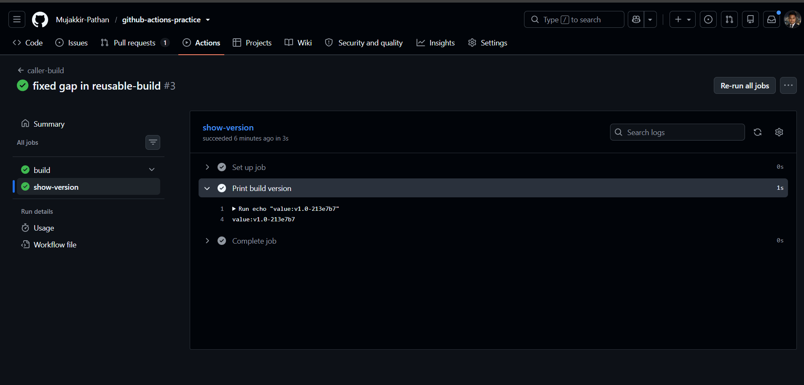
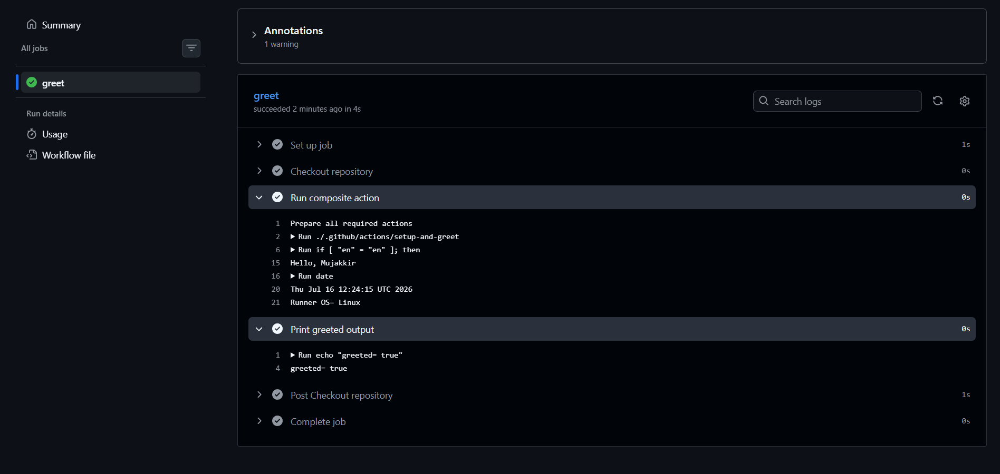

# Day 46 – Reusable Workflows & Composite Actions

## Expected Output

* Created a reusable workflow and a caller workflow in the `github-actions-practice` repository.
* Created a custom composite action.
* Created `day-46-reusable-workflows.md`.

---

# Task 1: Understand `workflow_call`

### What is a reusable workflow?

A reusable workflow is a workflow that can be called by other workflows to reuse CI/CD logic.

### What is the `workflow_call` trigger?

`workflow_call` is a trigger that allows one workflow to be called by another workflow.

### How is calling a reusable workflow different from using a regular action (`uses:`)?

* Reusable workflows are called at the job level.
* Actions are used at the step level.

### Where must a reusable workflow file live?

```text
.github/workflows/
```

---

# Task 2: Create Your First Reusable Workflow

* Created `.github/workflows/reusable-build.yml`.
* Set the trigger to `workflow_call`.
* Added `app_name` input.
* Added `environment` input.
* Added `docker_token` secret.
* Checked out the repository.
* Printed the build information.
* Verified the Docker token without printing its value.

[reusable-build.yml](https://github.com/Mujakkir-Pathan/github-actions-practice/blob/main/.github/workflows/reusable-build.yml)

---

# Task 3: Create a Caller Workflow

* Created `.github/workflows/call-build.yml`.
* Triggered on `push` to `main`.
* Called `reusable-build.yml`.
* Passed `app_name` as `my-web-app`.
* Passed `environment` as `production`.
* Passed `DOCKER_TOKEN` secret.
* Verified the reusable workflow execution.
* Verified the input values.

[call-build.yml](https://github.com/Mujakkir-Pathan/github-actions-practice/blob/main/.github/workflows/call-build.yml)



---

# Task 4: Add Outputs to the Reusable Workflow

* Added the `build_version` workflow output.
* Generated `build_version` using the short commit SHA.
* Exposed the step output as a job output.
* Exposed the job output as a workflow output.
* Read the `build_version` output in the caller workflow.
* Printed the `build_version` output.
* Verified the output.



---

# Task 5: Create a Composite Action

* Created `.github/actions/setup-and-greet/action.yml`.
* Added the `name` input.
* Added the `language` input with the default value `en`.
* Printed the greeting.
* Printed the current date.
* Printed the runner OS.
* Set the `greeted` output to `true`.
* Created a workflow to use the composite action.
* Used `./.github/actions/setup-and-greet`.
* Passed the `name` input.
* Verified the greeting.
* Verified the date and runner OS.
* Verified the `greeted` output.

[action.yml](https://github.com/Mujakkir-Pathan/github-actions-practice/blob/main/.github/actions/setup-and-greet/action.yml)



---

# Task 6: Reusable Workflow vs Composite Action

| Reusable Workflow                                                 | Composite Action                           |
| ----------------------------------------------------------------- | ------------------------------------------ |
| `workflow_call`                                                   | `uses:` in a step                          |
| Yes                                                               | No                                         |
| Yes                                                               | Yes                                        |
| `.github/workflows/`                                              | `.github/actions/<action-name>/action.yml` |
| Yes                                                               | No                                         |
| Reusing complete workflows (build, test, deploy, CI/CD pipelines) | Reusing a group of steps inside a job      |

