# Day 47 – Advanced Triggers: PR Events, Cron Schedules & Event-Driven Pipelines

## Task

Used advanced GitHub Actions triggers including pull request lifecycle events, scheduled cron workflows, workflow chaining, path filters, and external event triggers.

## Expected Output

* Created multiple workflow files demonstrating advanced triggers.
* Created a markdown file: `day-47-advanced-triggers.md`.
* Created at least one scheduled workflow for the repository.

## Challenge Tasks

### Task 1: Pull Request Event Types

Created `.github/workflows/pr-lifecycle.yml` that triggers on `pull_request` with specific activity types.

* Triggered on: `opened`, `synchronize`, `reopened`, `closed`.
* Printed the event type using `${{ github.event.action }}`.
* Printed the PR title using `${{ github.event.pull_request.title }}`.
* Printed the PR author using `${{ github.event.pull_request.user.login }}`.
* Printed the source branch and target branch.
* Added a conditional step that runs only when the PR is merged.

**Test it: create a PR, push an update to it, then merge it. Watch the workflow fire each time with a different event type.**

Created a PR, pushed an update, and merged it. Verified the workflow triggered on `opened`, `synchronize`, and `closed` events. The merge-only step executed successfully. (`reopened` was not tested.)

[pr-lifecycle.yml](https://github.com/Mujakkir-Pathan/github-actions-practice/blob/main/.github/workflows/pr-lifecycle.yml)

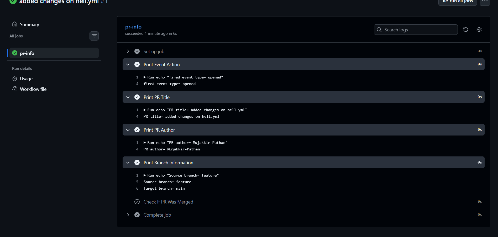

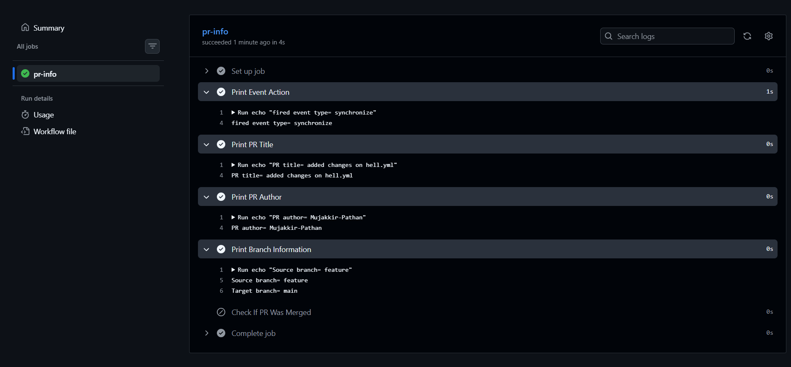

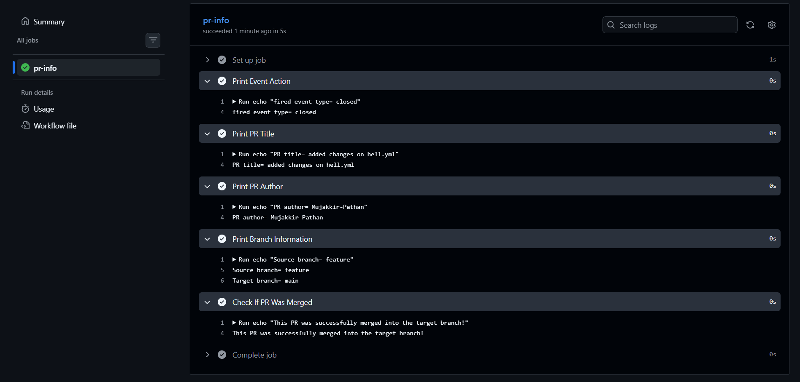

---

### Task 2: PR Validation Workflow

Created `.github/workflows/pr-checks.yml`.

* Triggered on `pull_request` to `main`.
* Added a `file-size-check` job.
* Checked out the code.
* Failed if any file in the PR exceeded 1 MB.
* Added a `branch-name-check` job.
* Read the branch name using `${{ github.head_ref }}`.
* Failed if the branch name did not follow `feature/*`, `fix/*`, or `docs/*`.
* Added a `pr-body-check` job.
* Read the PR body using `${{ github.event.pull_request.body }}`.
* Warned without failing if the PR description was empty.

**Verify: Open a PR from a badly named branch — does the check fail?**

Yes. The branch-name check failed for an invalid branch name.

[pr-checks.yml](https://github.com/Mujakkir-Pathan/github-actions-practice/blob/main/.github/workflows/pr-checks.yml)

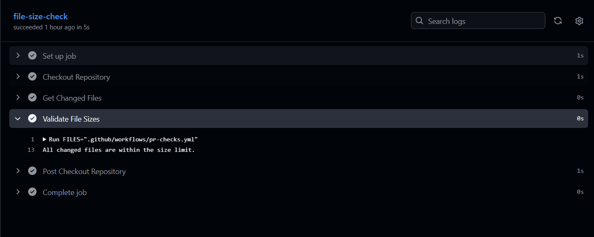

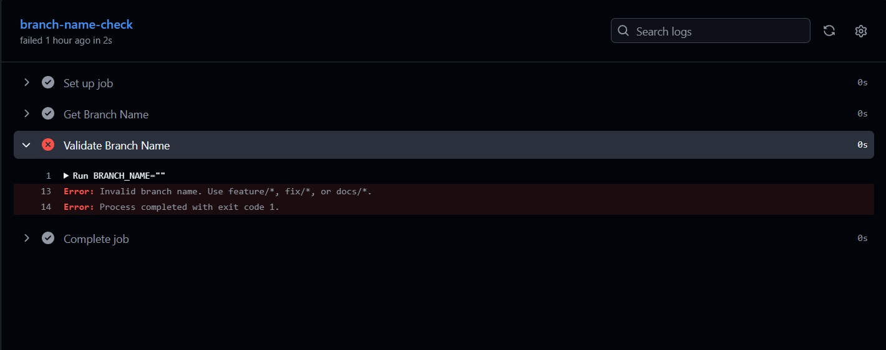

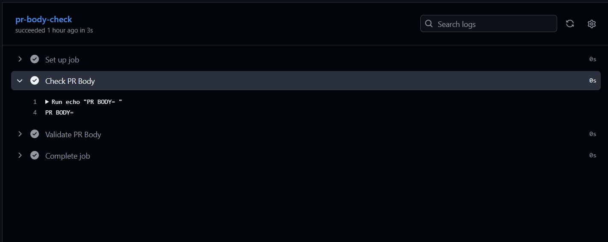

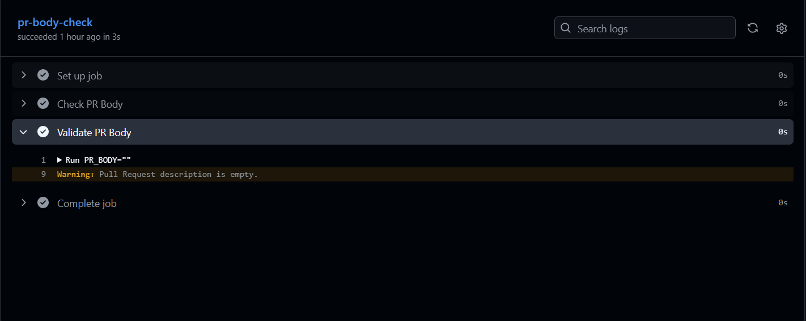

---

### Task 3: Scheduled Workflows (Cron Deep Dive)

Created `.github/workflows/scheduled-tasks.yml`.

* Added a `schedule` trigger with `cron: '30 2 * * 1'`.
* Added another cron entry: `cron: '0 */6 * * *'`.
* Printed the triggering schedule using `${{ github.event.schedule }}`.
* Added a health check using `curl` and printed the HTTP response code.
* Added `workflow_dispatch` for manual testing.

[scheduled-tasks.yml](https://github.com/Mujakkir-Pathan/github-actions-practice/blob/main/.github/workflows/scheduled-tasks.yml)

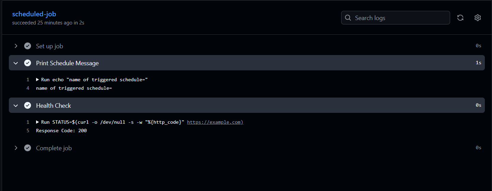

**Write in your notes:**

**The cron expression for: every weekday at 9 AM IST**

`30 3 * * 1-5`

**The cron expression for: first day of every month at midnight**

`0 0 1 * *`

**Why GitHub says scheduled workflows may be delayed or skipped on inactive repos**

Scheduled workflows may be delayed due to GitHub infrastructure load, may be disabled on inactive repositories, and run only from the default branch.

---

### Task 4: Path & Branch Filters

Created `.github/workflows/smart-triggers.yml`.

* Triggered on `push` only when files in `src/` or `app/` changed.
* Created a second workflow using `paths-ignore`.
* Ignored changes to `*.md` and `docs/**`.
* Added branch filters for `main` and `release/*`.
* Verified the workflow skipped when only a `.md` file changed.

**Write in your notes: When would you use paths vs paths-ignore?**

Use `paths` to run workflows only when specific files or directories change. Use `paths-ignore` to skip workflows when only specified files or directories change.

[smart-triggers.yml](https://github.com/Mujakkir-Pathan/github-actions-practice/blob/main/.github/workflows/smart-triggers.yml)

[ignore-docs.yml](https://github.com/Mujakkir-Pathan/github-actions-practice/blob/main/.github/workflows/ignore-docs.yml)

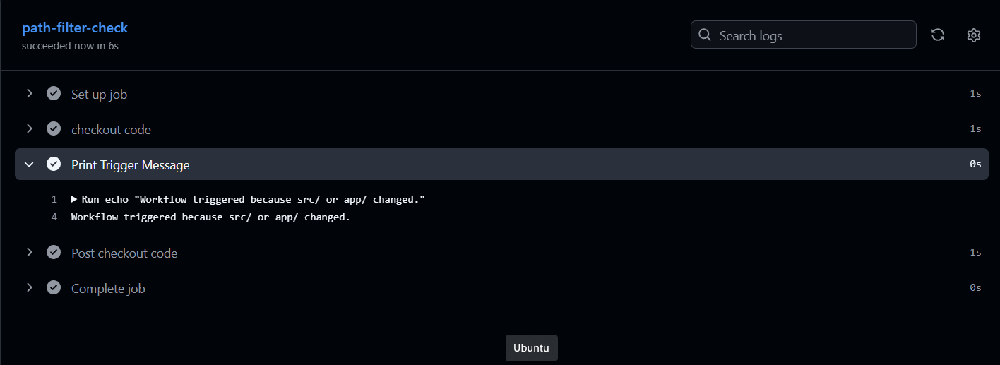

---

### Task 5: workflow_run — Chain Workflows Together

Created `.github/workflows/tests.yml` to run tests on every push.

Created `.github/workflows/deploy-after-tests.yml`.

* Triggered using `workflow_run`.
* Listened for the `"Run Tests"` workflow.
* Triggered on `completed`.
* Proceeded only when `${{ github.event.workflow_run.conclusion == 'success' }}`.
* Printed a warning and exited when the triggering workflow did not succeed.

**Verify: Push a commit — does the test workflow run first, then trigger the deploy workflow?**

Yes. The test workflow ran first and automatically triggered the deploy workflow after completion.

[tests.yml](https://github.com/Mujakkir-Pathan/github-actions-practice/blob/main/.github/workflows/tests.yml)

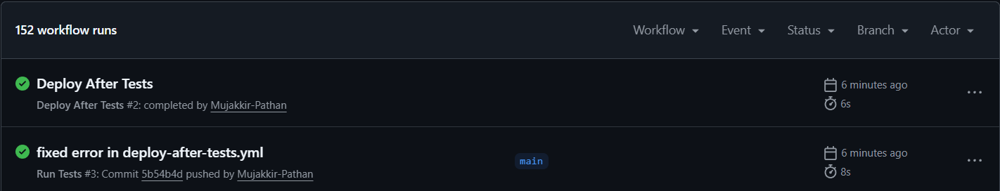

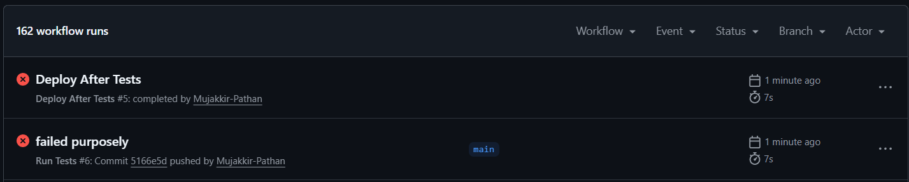

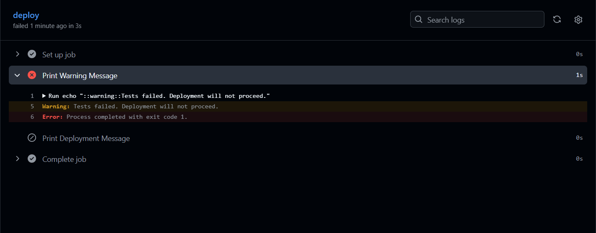

---

### Task 6: repository_dispatch — External Event Triggers

Created `.github/workflows/external-trigger.yml` with the `repository_dispatch` trigger.

* Responded to the `deploy-request` event type.
* Printed `${{ github.event.client_payload.environment }}`.
* Triggered the workflow using GitHub CLI.

**Write in your notes: When would an external system (like a Slack bot or monitoring tool) trigger a pipeline?**

External systems trigger pipelines to start GitHub Actions based on events outside GitHub, such as deployment requests from Slack, monitoring alerts, or integrations with external applications.

[external-trigger.yml](https://github.com/Mujakkir-Pathan/github-actions-practice/blob/main/.github/workflows/external-trigger.yml)

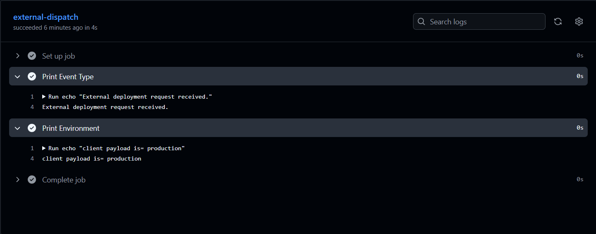

