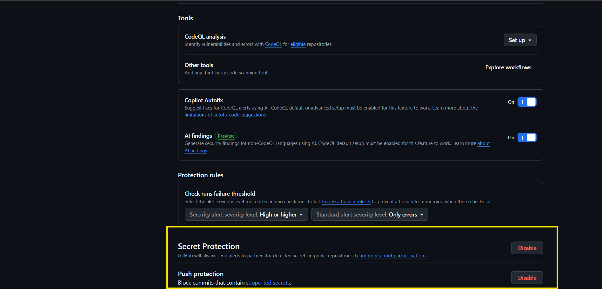
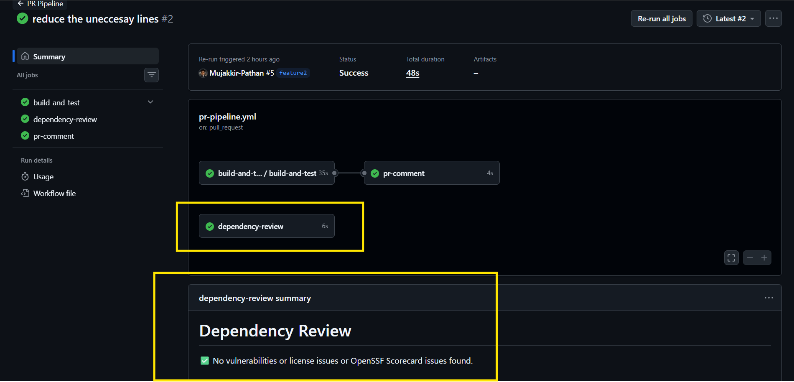
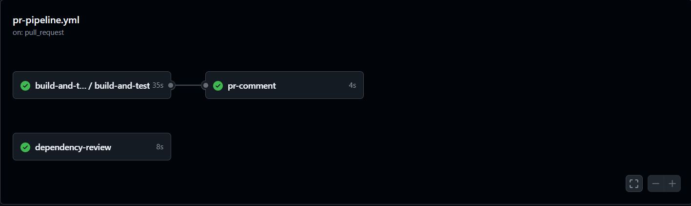
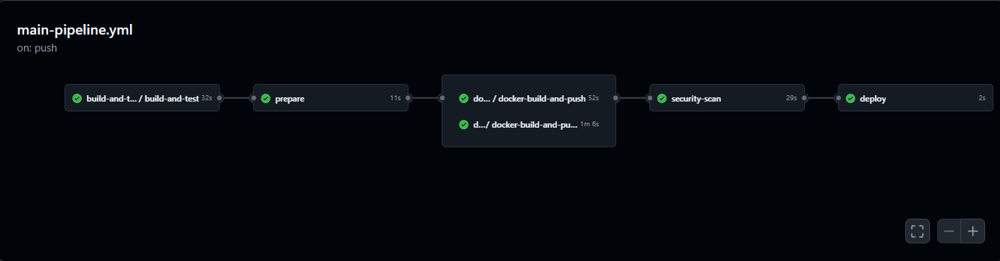

# Day 49 – DevSecOps: Add Security to Your CI/CD Pipeline

## Task

Completed the DevSecOps enhancements by integrating automated security checks into the existing CI/CD pipeline. Added Docker image vulnerability scanning, dependency vulnerability review, GitHub Secret Scanning, Push Protection, and least-privilege workflow permissions.

---

## Expected Output

- Added security scanning to the `github-actions-capstone` repository.
- Created `day-49-devsecops.md`.
- Captured a screenshot of the security scan running in the pipeline.

---

## What is DevSecOps?

DevSecOps integrates automated security checks into the CI/CD pipeline so vulnerabilities and security issues are detected before deployment instead of after reaching production.

---

## Key Principles (Keep These in Mind)

- Caught security issues early during the CI/CD process.
- Automated security checks within GitHub Actions workflows.
- Configured the pipeline to fail on critical vulnerabilities.
- Used GitHub Secrets instead of hardcoded credentials.
- Applied the principle of least privilege by limiting workflow permissions.

---
## Capstone Project link

[devboard app](https://github.com/Mujakkir-Pathan/github-actions-capstone)
---

# Challenge Tasks

## Task 1: Scan Your Docker Image for Vulnerabilities

- Added Trivy vulnerability scanning to the main pipeline.
- Configured Trivy to scan Docker images for known CVEs.
- Configured the scan to fail on **CRITICAL** vulnerabilities.
- Reviewed the scan output in GitHub Actions.

### Verify

**Can you see the vulnerability table in the logs? Did it pass or fail?**

Yes. The vulnerability scan appeared in the workflow logs and failed when a critical vulnerability was detected.

### Write in your notes

**What CVEs (if any) were found? What base image are you using?**

- Trivy detected critical vulnerabilities during the scan.
- Base image: Alpine Linux (`alpine:3.24`).

---

## Task 2: Enable GitHub's Built-in Secret Scanning

- Enabled GitHub Secret Scanning.
- Enabled Push Protection.

### Write in your notes

**What is the difference between secret scanning and push protection?**

Secret Scanning detects exposed secrets already present in the repository. Push Protection blocks commits containing supported secrets before they are pushed.

**What happens if GitHub detects a leaked AWS key in your repo?**

GitHub detects the leaked key, generates a security alert, and Push Protection blocks the push if enabled.

---

## Task 3: Scan Dependencies for Known Vulnerabilities

- Added the Dependency Review Action to the Pull Request workflow.
- Configured the workflow to fail on critical dependency vulnerabilities.
- Verified the dependency review job executed successfully during a Pull Request.

### Verify

**Does the dependency review show up as a check on your PR?**

Yes. The Dependency Review job appeared and completed successfully as a Pull Request check.

---

## Task 4: Add Permissions to Your Workflows

- Added least-privilege permissions to the Main Pipeline workflow.
- Added least-privilege permissions to the PR Pipeline workflow.

### Write in your notes

**Why is it a good practice to limit workflow permissions?**

Limiting permissions reduces the attack surface and ensures workflows receive only the access required to perform their tasks.

**What could go wrong if a compromised action has write access to your repo?**

A compromised action could modify source code, push malicious commits, create releases, or tamper with the repository.

---

## Task 5: See the Full Secure Pipeline

                    Pull Request
                         │
          ┌──────────────┴──────────────┐
          │                             │
          ▼                             ▼
     Build & Test              Dependency Review
          │                             │
          └──────────────┬──────────────┘
                         ▼
                  PR Comment / Checks
                         │
                    Merge to main
                         │
                         ▼
                  Build & Test
                         │
                         ▼
                   Prepare SHA
                         │
                         ▼
            Build Docker Images
                         │
                         ▼
          Trivy Security Scan
       (Frontend & Backend Images)
                         │
              Pass? ─────┴───── No
               │               │
              Yes              ▼
               │         Pipeline Fails
               ▼
          Deploy to Production

Repository Protection
├── Secret Scanning
└── Push Protection
---

## Brownie Points (Optional — For the Curious)

### Pin Actions to Commit SHAs

Pinned GitHub Actions to specific versions to improve workflow security and reduce supply chain risks.

### Upload Scan Results to GitHub Security Tab

Configured Trivy to generate SARIF output and explored uploading scan results to the GitHub Security tab using the CodeQL SARIF upload action.

### Learn About OIDC (Keyless Authentication)

Learned how GitHub Actions can use OpenID Connect (OIDC) to obtain short-lived cloud credentials instead of storing long-lived secrets, providing a more secure authentication approach.

---

## Full PR Pipeline

   

## Full Main Pipeline

   

