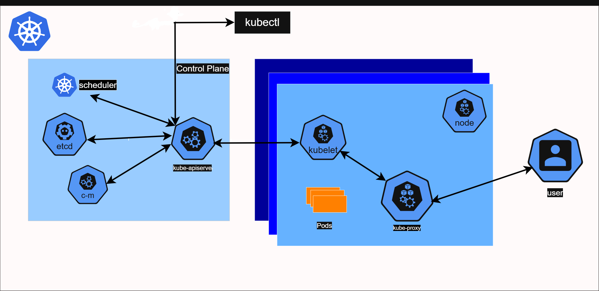
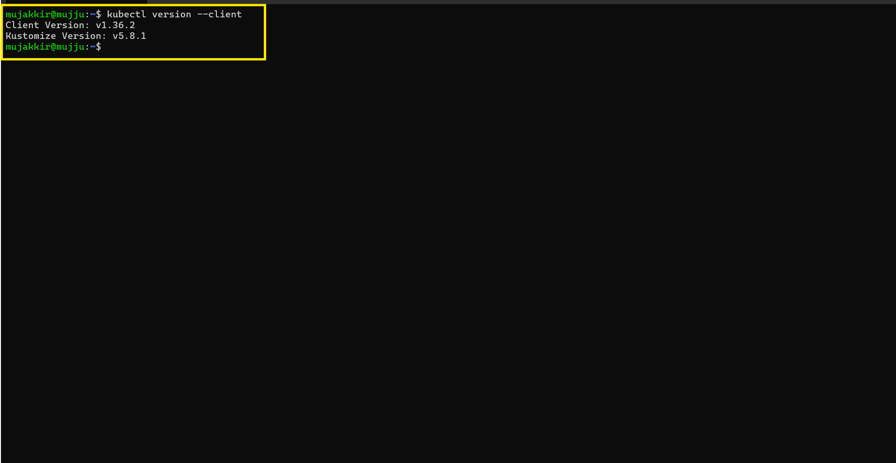
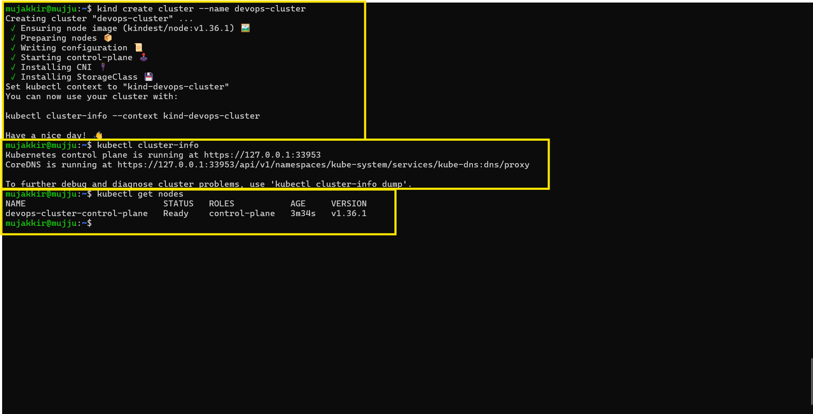
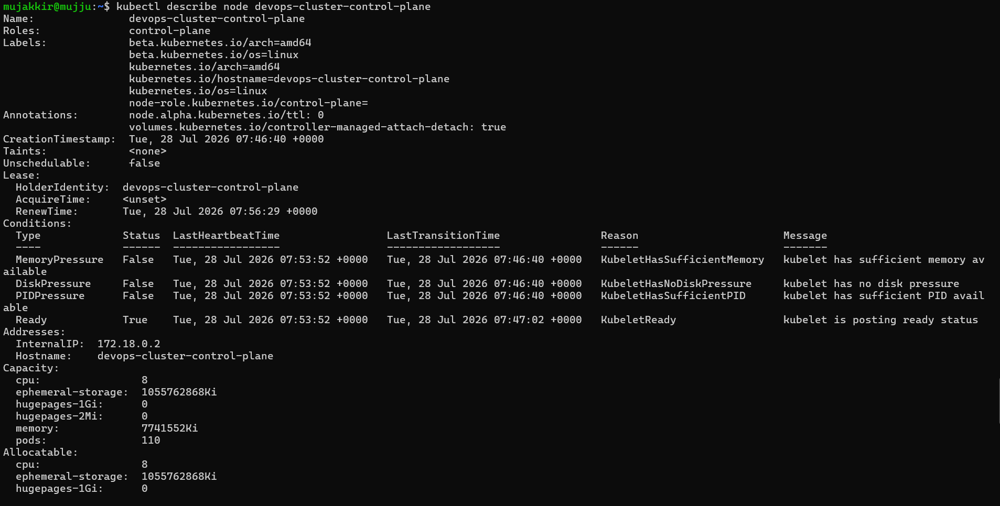
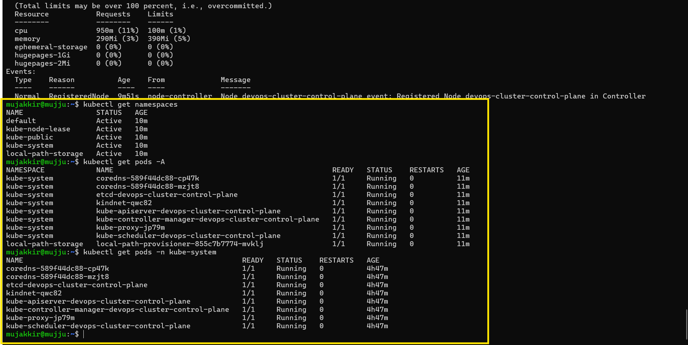
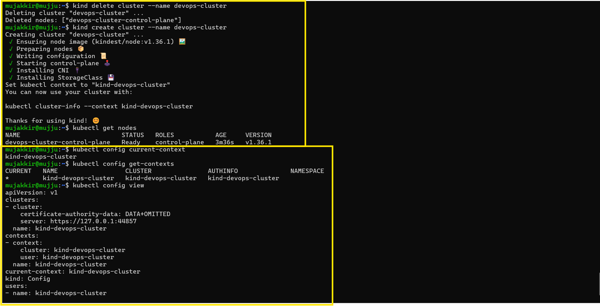

# Day 50 – Kubernetes Architecture and Cluster Setup

## Task

Completed the Kubernetes architecture overview, set up a local Kubernetes cluster using kind, explored the cluster components, and practiced basic cluster lifecycle operations using kubectl.

---

# Challenge Tasks

## Task 1: Recall the Kubernetes Story

### Why was Kubernetes created? What problem does it solve that Docker alone cannot?

Kubernetes was created to orchestrate and manage containerized applications across multiple machines. Unlike Docker alone, it provides scheduling, scaling, self-healing, load balancing, and automated deployment for containers.

### Who created Kubernetes and what was it inspired by?

Kubernetes was created by **Google** and inspired by Google's internal cluster management system called **Borg**.

### What does the name "Kubernetes" mean?

Kubernetes is a Greek word meaning **"Helmsman"** or **"Pilot."**

---

## Task 2: Draw the Kubernetes Architecture

### Kubernetes Architecture

### What happens when you run `kubectl apply -f pod.yaml`? Trace the request through each component.

`kubectl` sends the request to the API Server. The API Server validates the request and stores the desired state in etcd. The Scheduler selects a suitable worker node for the Pod. The kubelet on that node receives the assignment and instructs the Container Runtime to create and run the container. The kubelet then reports the Pod status back to the API Server.

### What happens if the API server goes down?

No new Kubernetes API requests can be processed, and cluster management operations stop until the API Server becomes available again. Existing running Pods continue to run.

### What happens if a worker node goes down?

The Pods running on that node become unavailable. The Controller Manager detects the failure and schedules replacement Pods on healthy worker nodes if available.

---

## Task 3: Install kubectl

Installed `kubectl` and verified the installation.

---

## Task 4: Set Up Your Local Cluster

Selected **kind (Kubernetes in Docker)**.

### Why did you choose it?

kind is lightweight, Docker-based, quick to set up, integrates well with WSL2, and is suitable for local Kubernetes development and learning.

Created a cluster named **devops-cluster** and verified it using:

- `kubectl cluster-info`
- `kubectl get nodes`

---

## Task 5: Explore Your Cluster

Explored the cluster using:

- `kubectl cluster-info`
- `kubectl get nodes`
- `kubectl describe node devops-cluster-control-plane`
- `kubectl get namespaces`
- `kubectl get pods -A`
- `kubectl get pods -n kube-system`

### Verify: Can you match each running pod in kube-system to a component in your architecture diagram?

| Pod | Component |
|------|-----------|
| kube-apiserver | API Server |
| etcd | etcd |
| kube-scheduler | Scheduler |
| kube-controller-manager | Controller Manager |
| kube-proxy | kube-proxy |
| coredns | Cluster DNS |
| kindnet | Cluster networking (kind) |
| local-path-provisioner | Local Persistent Volume Provisioner |

---

## Task 6: Practice Cluster Lifecycle

Deleted and recreated the Kubernetes cluster successfully.

Verified the recreated cluster using:

- `kubectl get nodes`

Executed the following configuration commands:

- `kubectl config current-context`
- `kubectl config get-contexts`
- `kubectl config view`

### What is a kubeconfig?

A kubeconfig is a configuration file used by `kubectl` that stores Kubernetes cluster information, users, contexts, and authentication details.

### Where is it stored on your machine?

`~/.kube/config`
