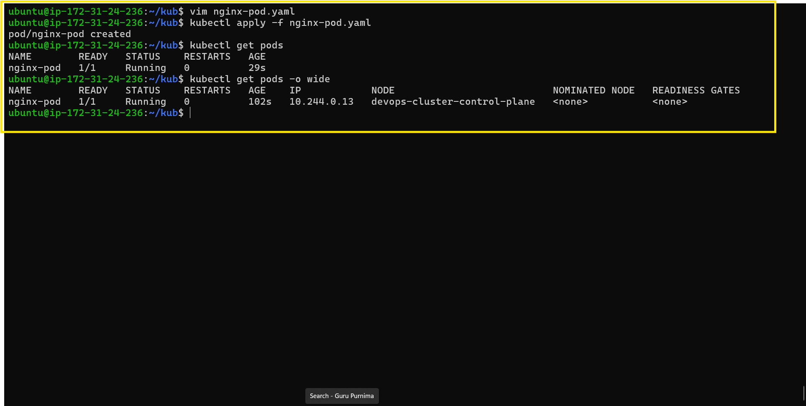
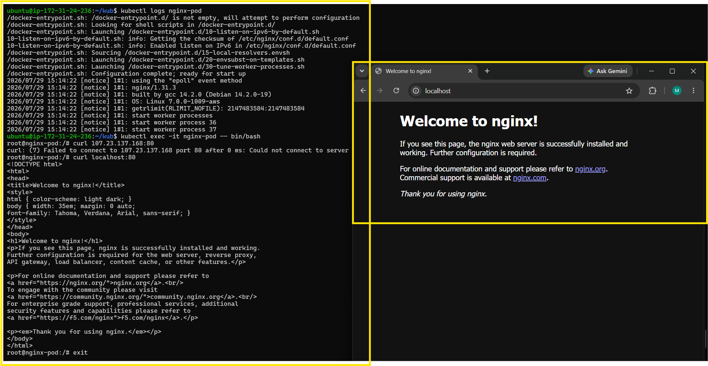
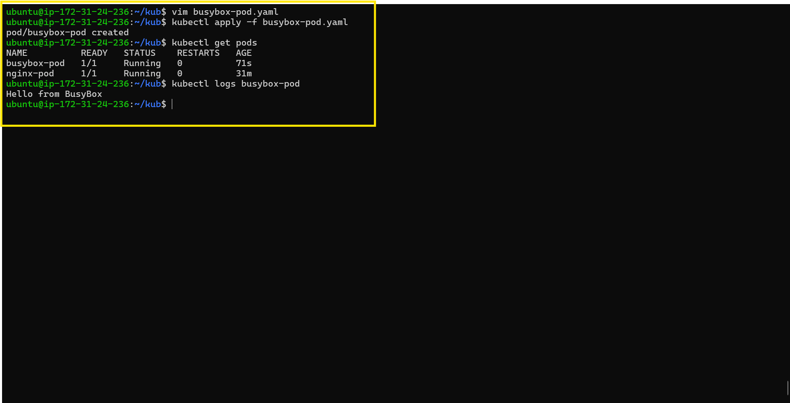
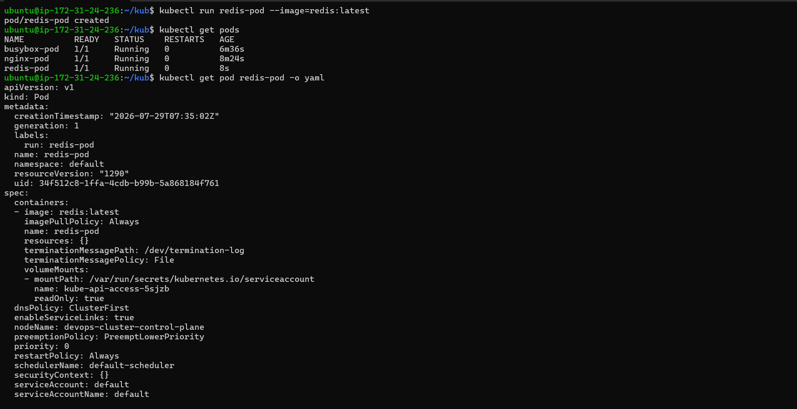
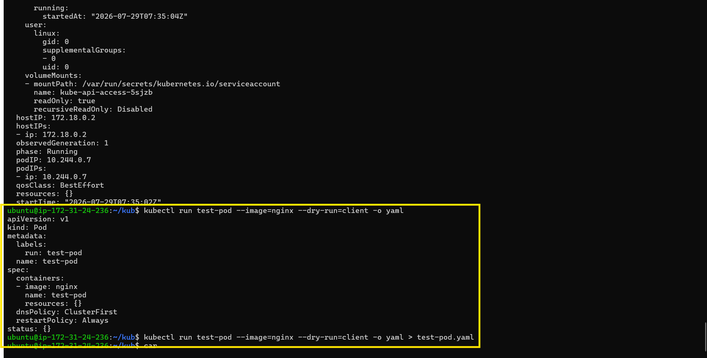
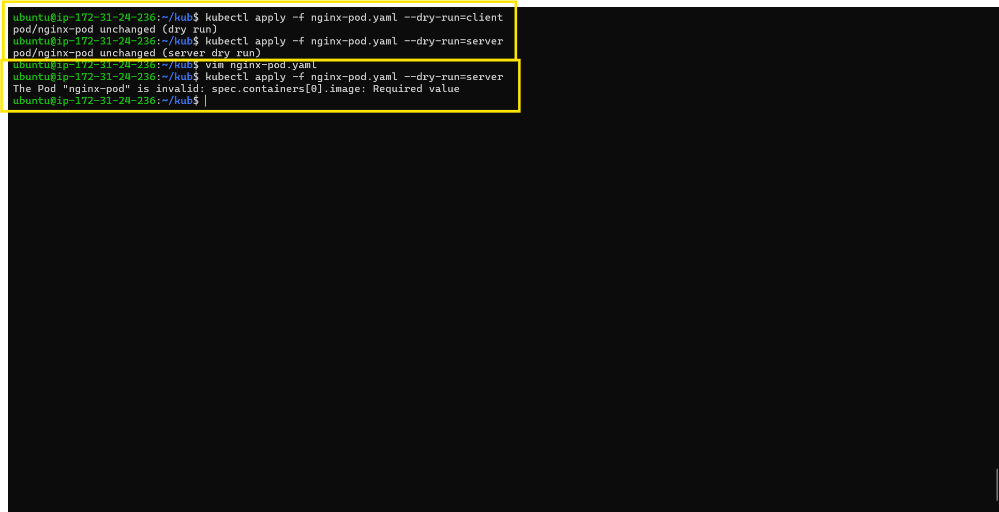
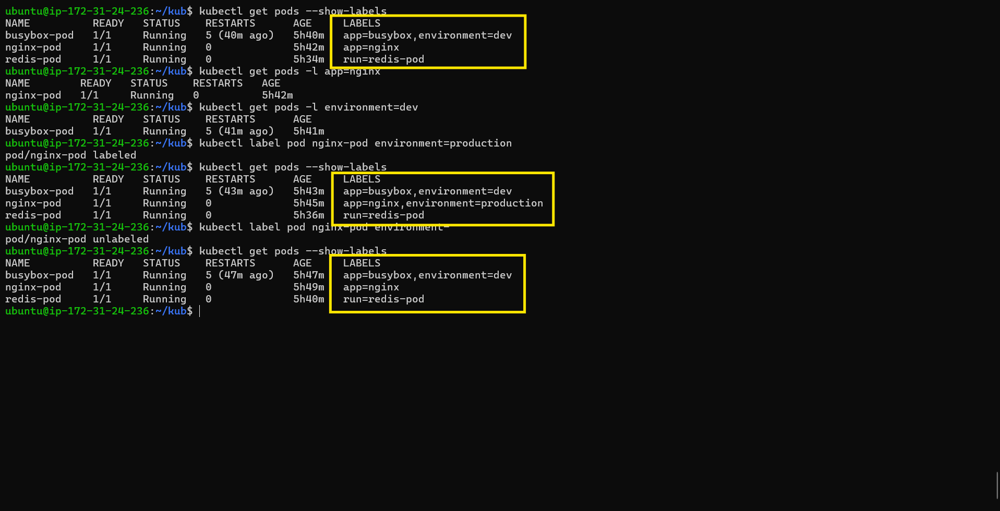
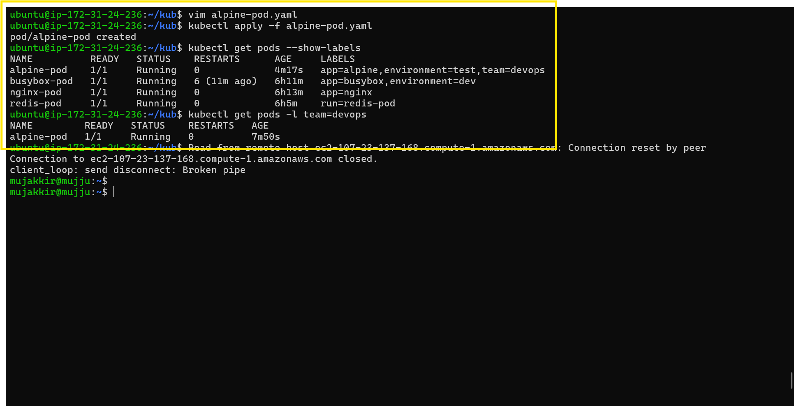
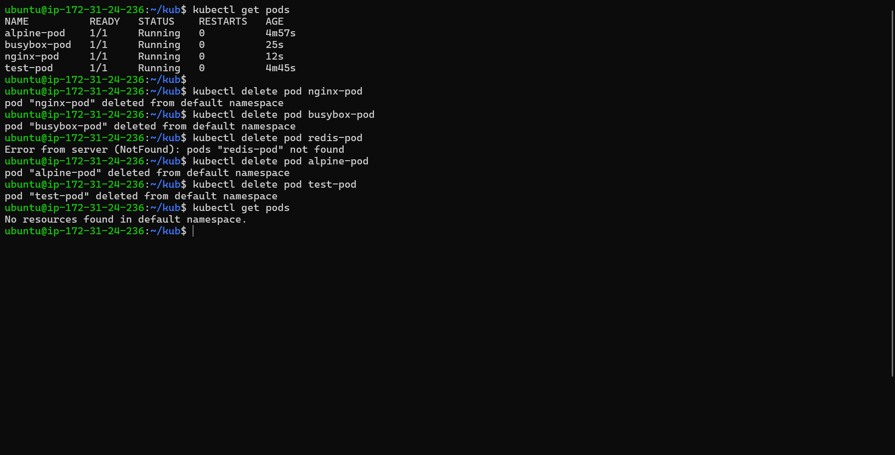

# Day 51 – Kubernetes Manifests and Your First Pods

## Task

Learned the structure of Kubernetes manifest files and created Pods using handwritten YAML manifests. Practiced deploying, validating, inspecting, labeling, and deleting Pods using `kubectl`.


## The Anatomy of a Kubernetes Manifest

Every Kubernetes resource is defined using a YAML manifest with four required top-level fields:

```yaml
apiVersion: v1          # Which API version to use
kind: Pod               # What type of resource
metadata:               # Name, labels, namespace
  name: my-pod
  labels:
    app: my-app
spec:                   # The actual specification (what you want)
  containers:
  - name: my-container
    image: nginx:latest
    ports:
    - containerPort: 80
```

* **apiVersion** — Specifies which Kubernetes API group to use. Pods use `v1`.
* **kind** — Defines the Kubernetes resource type.
* **metadata** — Defines the resource identity, including its name and labels.
* **spec** — Defines the desired state of the resource, including containers, images, ports, and other configuration.

## Challenge Tasks

### Task 1: Create Your First Pod (Nginx)

Created `nginx-pod.yaml` with an Nginx container, applied the manifest, verified the Pod reached the `Running` state, inspected the Pod using `kubectl describe`, viewed the container logs, accessed the container using `kubectl exec`, and confirmed the Nginx Welcome page by running `curl localhost:80` inside the Pod.




**Verify:** Can you see the Nginx welcome page when you curl from inside the pod?

**Answer:**
Yes.

---

### Task 2: Create a Custom Pod (BusyBox)

Created `busybox-pod.yaml` from scratch with custom labels and a command to keep the container running. Applied the manifest, verified the Pod, and viewed its logs.



**Verify:** Can you see "Hello from BusyBox" in the logs?

**Answer:**
Yes.

---

### Task 3: Imperative vs Declarative

Created `redis-pod` using the imperative `kubectl run` command, inspected the generated YAML, generated a Pod manifest using `--dry-run=client`, saved it to a file, and compared it with the handwritten manifest.





**Verify:** Save the dry-run output to a file and compare its structure with your nginx-pod.yaml. What fields are the same? What is different?

**Answer:**

**Same fields:**

* `apiVersion`
* `kind`
* `metadata.name`
* `metadata.labels`
* `spec.containers`
* `image`

**Different fields:**

* The generated YAML included default fields such as `restartPolicy`, `dnsPolicy`, and `resources`.
* The YAML retrieved from the running Pod also included automatically generated metadata such as `uid`, `resourceVersion`, `creationTimestamp`, and the `status` section.

---

### Task 4: Validate Before Applying

Validated the manifest using both client-side and server-side dry runs. Removed the `image` field to verify validation behavior.




**Verify:** What error does Kubernetes give when the image field is missing?

**Answer:**

```text
The Pod "nginx-pod" is invalid: spec.containers[0].image: Required value
```

---

### Task 5: Pod Labels and Filtering

Listed Pod labels, filtered Pods using label selectors, added and removed labels from an existing Pod, created a third Pod with `app`, `environment`, and `team` labels, and verified label-based filtering.




---

### Task 6: Clean Up

Deleted all created Pods and verified that no Pods remained in the namespace.


