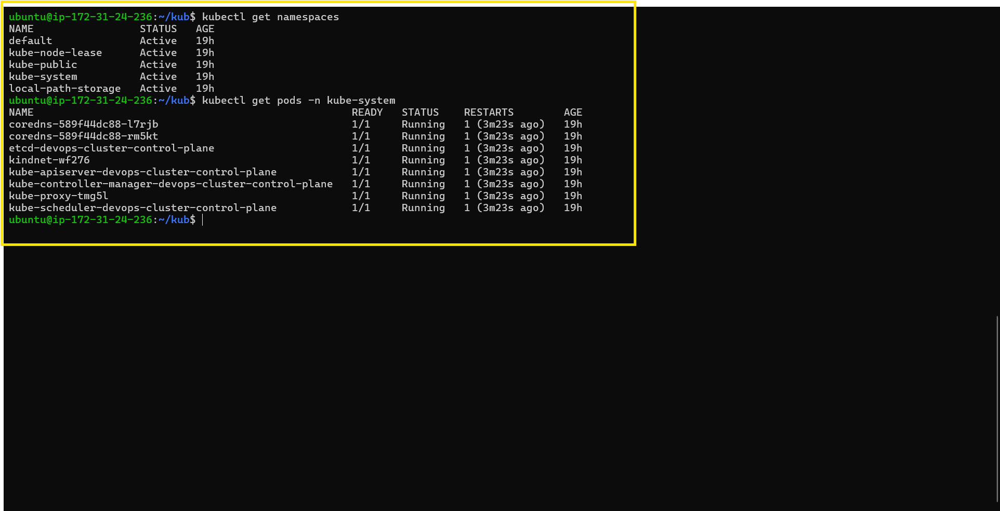
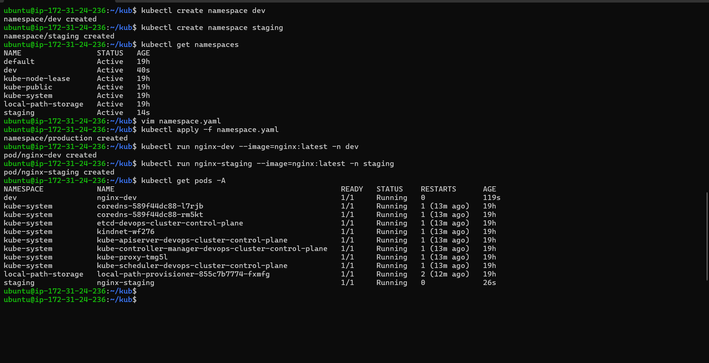
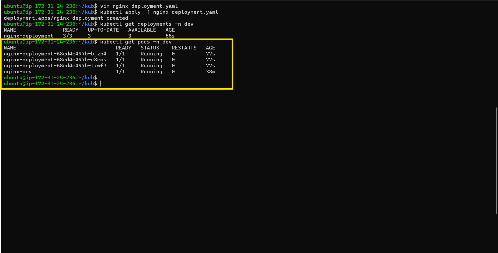
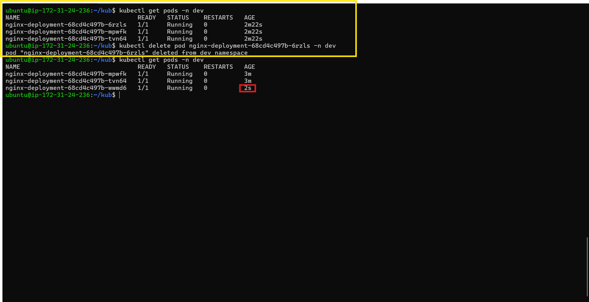
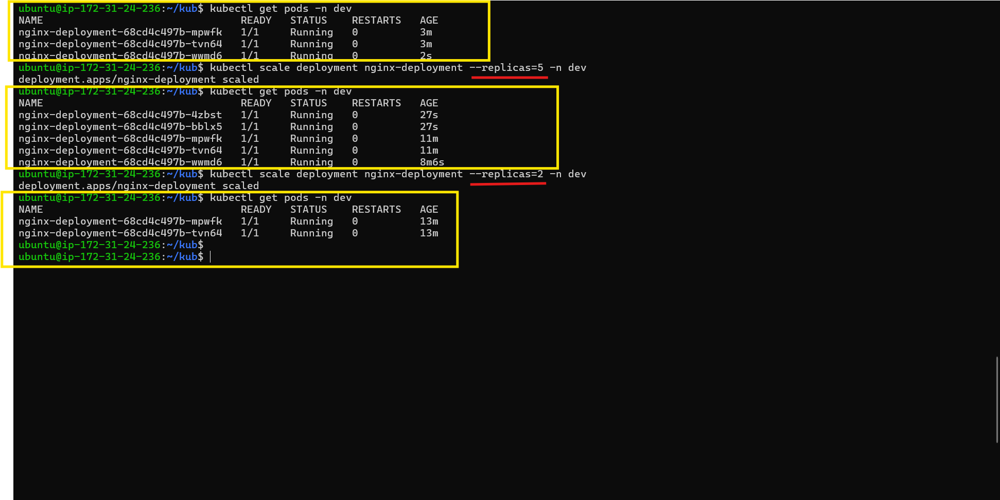
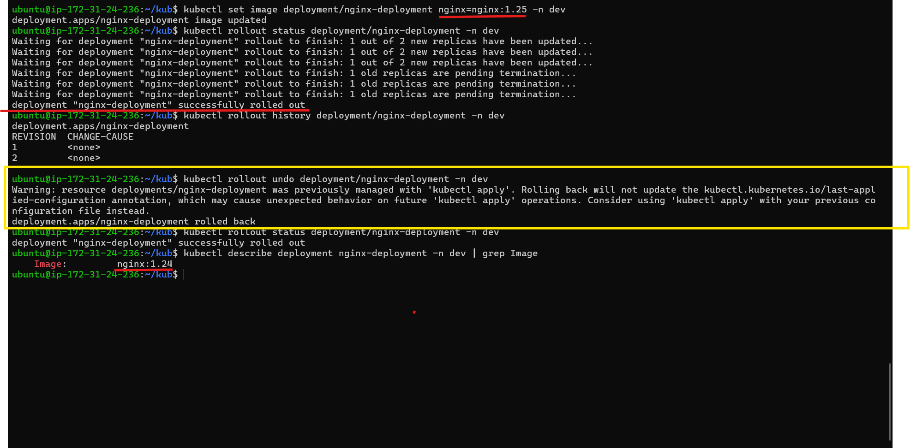

# Day 52 – Kubernetes Namespaces and Deployments

## Task

Created and used Kubernetes Namespaces to organize resources inside the cluster. Created a Deployment to manage multiple Pod replicas, demonstrated self-healing, scaled the Deployment, performed a rolling update, rolled back to the previous version, and cleaned up all created resources.

---

## Challenge Tasks

### Task 1: Explore Default Namespaces

Listed the built-in Kubernetes namespaces.

Verified the Pods running inside the `kube-system` namespace.



**Verify:** How many pods are running in `kube-system`?

**Answer:** 8 Pods.

---

### Task 2: Create and Use Custom Namespaces

Created the `dev` and `staging` namespaces.

Verified the namespaces were created successfully.

Created the `production` namespace using a manifest.

Created an Nginx Pod in both the `dev` and `staging` namespaces.

Listed Pods across all namespaces.



**Verify:** Does `kubectl get pods` show these pods? What about `kubectl get pods -A`?

**Answer:**

* `kubectl get pods` only shows Pods in the current namespace.
* `kubectl get pods -A` shows Pods across all namespaces.

---

### Task 3: Create Your First Deployment

Created the `nginx-deployment.yaml` manifest.

Configured:

* `kind: Deployment`
* `apiVersion: apps/v1`
* `replicas: 3`
* Matching labels and selectors
* Pod template using the `nginx:1.24` image

Applied the Deployment and verified that three Pods were created successfully.




**Verify:** What do the READY, UP-TO-DATE, and AVAILABLE columns mean in the deployment output?

**Answer:**

* **READY:** Number of running and ready Pods.
* **UP-TO-DATE:** Number of Pods using the latest Deployment specification.
* **AVAILABLE:** Number of healthy Pods available to serve traffic.

---

### Task 4: Self-Healing — Delete a Pod and Watch It Come Back

Deleted one Pod managed by the Deployment.

Verified that Kubernetes automatically created a replacement Pod to maintain the desired replica count.



**Verify:** Is the replacement pod's name the same as the one you deleted, or different?

**Answer:** Different. Kubernetes created a new Pod with a new unique name.

---

### Task 5: Scale the Deployment

Scaled the Deployment from 3 replicas to 5 replicas.

Scaled the Deployment back down from 5 replicas to 2 replicas.

Observed Kubernetes automatically creating and terminating Pods to match the desired replica count.



**Verify:** When you scaled down from 5 to 2, what happened to the extra pods?

**Answer:** Kubernetes gracefully terminated the extra Pods to match the desired replica count.

---

### Task 6: Rolling Update

Updated the Deployment image from `nginx:1.24` to `nginx:1.25`.

Verified the rollout completed successfully.

Viewed the rollout history.

Rolled back the Deployment to the previous revision.

Verified the image version after the rollback.



**Verify:** What image version is running after the rollback?

**Answer:** `nginx:1.24`

---

### Task 7: Clean Up

Deleted the Deployment.

Deleted the standalone Pods.

Deleted the `dev`, `staging`, and `production` namespaces.

Verified that all created resources were removed.

**Verify:** Are all your resources gone?

**Answer:** Yes. Only the default Kubernetes system resources remained.

---

## Documentation

### What namespaces are and why you would use them

Namespaces logically separate resources inside a Kubernetes cluster. They are commonly used to isolate environments such as development, staging, and production while allowing multiple applications or teams to share the same cluster.

### Your Deployment manifest and an explanation of each section

```yaml
apiVersion: apps/v1
kind: Deployment
metadata:
  name: nginx-deployment
  namespace: dev
  labels:
    app: nginx
spec:
  replicas: 3
  selector:
    matchLabels:
      app: nginx
  template:
    metadata:
      labels:
        app: nginx
    spec:
      containers:
      - name: nginx
        image: nginx:1.24
        ports:
        - containerPort: 80
```

* **apiVersion** – Specifies the Kubernetes API version.
* **kind** – Defines the resource as a Deployment.
* **metadata** – Stores the Deployment name, namespace, and labels.
* **spec.replicas** – Specifies the desired number of Pod replicas.
* **selector.matchLabels** – Identifies which Pods are managed by the Deployment.
* **template** – Defines the Pod blueprint used to create replicas.
* **containers** – Specifies the container image and exposed port.

### What happens when you delete a Pod managed by a Deployment vs a standalone Pod

Deleting a standalone Pod permanently removes it. Deleting a Pod managed by a Deployment causes Kubernetes to automatically create a replacement Pod to maintain the desired replica count.

### How scaling works (both imperative and declarative)

Imperative scaling uses commands such as `kubectl scale` to change the number of replicas immediately. Declarative scaling updates the `replicas` value in the Deployment manifest and applies the changes using `kubectl apply`.

### How rolling updates and rollbacks work

A rolling update gradually replaces old Pods with new Pods using the updated container image while keeping the application available. A rollback restores the previous Deployment revision if an update needs to be reverted.

### Screenshot of your Deployment and Pods running

Included screenshots of:

* `kubectl get deployments -n dev`
* `kubectl get pods -A`

