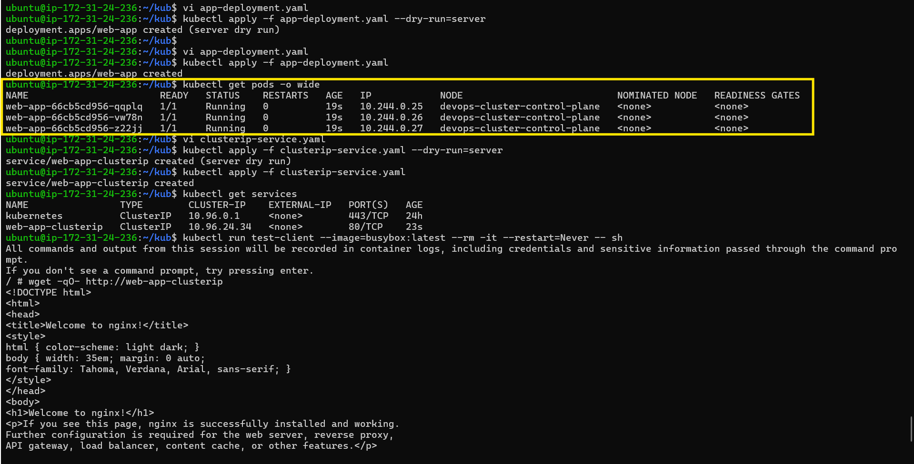
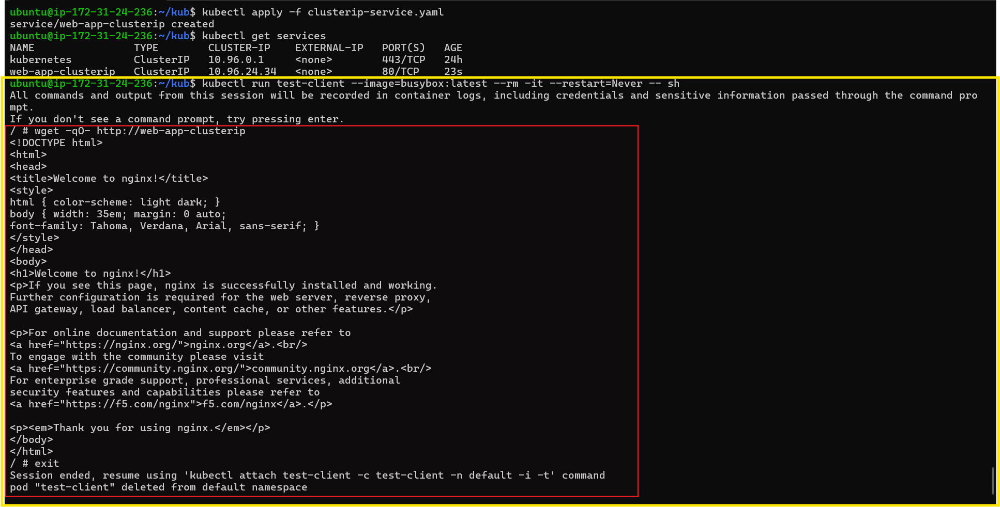
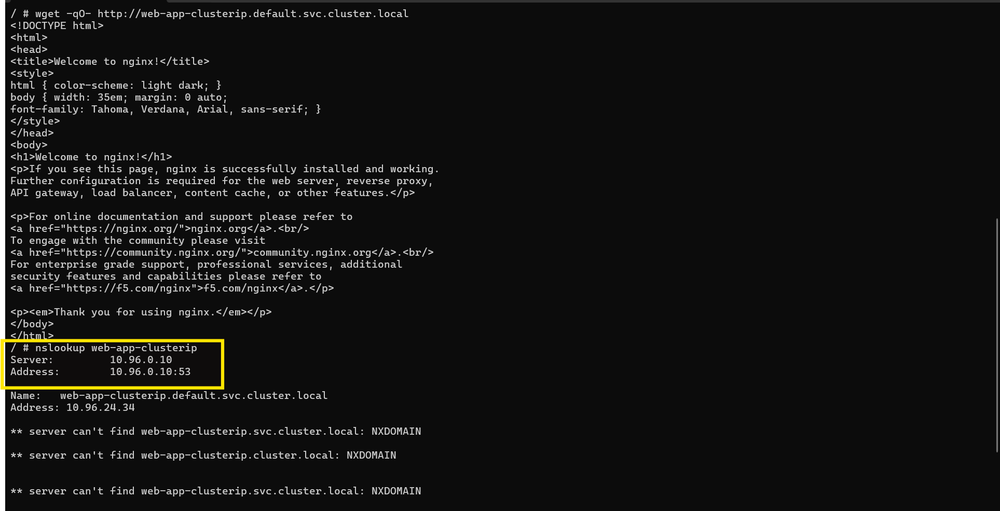
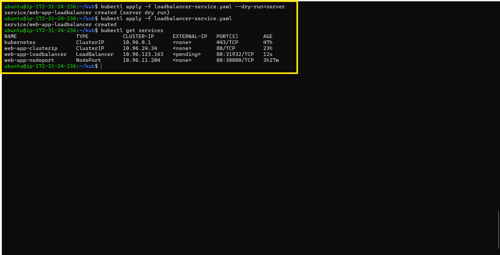
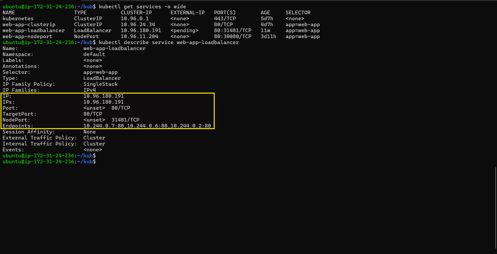
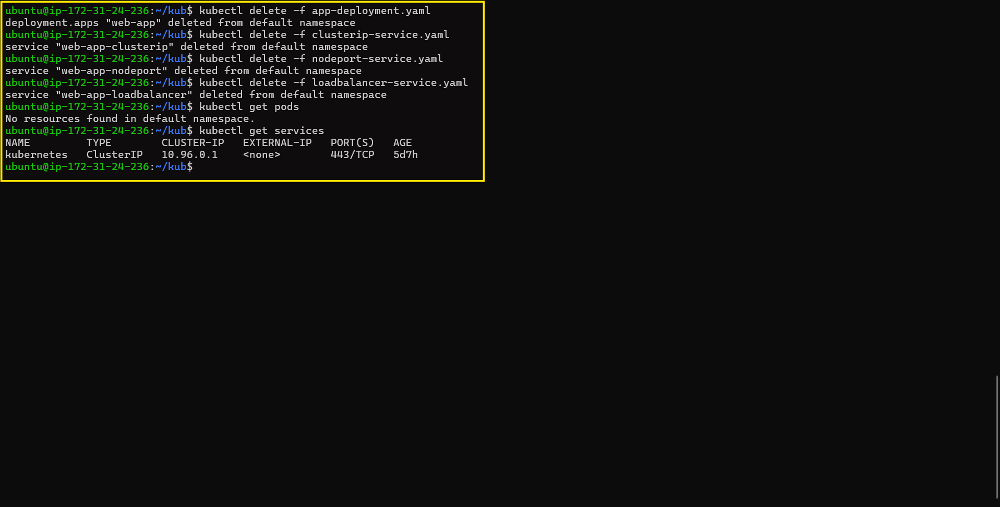

# Day 53 – Kubernetes Services

## Task

Created a Deployment and exposed it using ClusterIP, NodePort, and LoadBalancer Services. Verified Pod-to-Service communication from inside the cluster, explored Kubernetes DNS-based Service discovery, compared different Service types, and cleaned up all created resources.

---

## Why Services?

Every Pod gets its own IP address. But there are two problems:

1. Pod IPs are **not stable** — when a Pod restarts or gets replaced, it gets a new IP.
2. A Deployment runs **multiple Pods** — a stable endpoint is required instead of connecting directly to Pod IPs.

A Service solves both problems by providing:

* A **stable IP and DNS name** that never changes.
* **Load balancing** across all Pods that match its selector.

```
[Client] --> [Service (stable IP)] --> [Pod 1]
                                   --> [Pod 2]
                                   --> [Pod 3]
```

---

## Challenge Tasks

### Task 1: Deploy the Application

Created `app-deployment.yaml` and deployed an Nginx Deployment with **3 replicas**.

```yaml
apiVersion: apps/v1
kind: Deployment
metadata:
  name: web-app
  labels:
    app: web-app
spec:
  replicas: 3
  selector:
    matchLabels:
      app: web-app
  template:
    metadata:
      labels:
        app: web-app
    spec:
      containers:
      - name: nginx
        image: nginx:1.25
        ports:
        - containerPort: 80
```

**Verify:** Are all 3 Pods running? Note down their IP addresses.



Yes.

* `10.244.0.25`
* `10.244.0.26`
* `10.244.0.27`

---

### Task 2: ClusterIP Service (Internal Access)

Created `clusterip-service.yaml` and exposed the Deployment using a ClusterIP Service.

```yaml
apiVersion: v1
kind: Service
metadata:
  name: web-app-clusterip
spec:
  type: ClusterIP
  selector:
    app: web-app
  ports:
  - port: 80
    targetPort: 80
```

Verified the Service from inside the cluster using a temporary BusyBox Pod and successfully received the Nginx welcome page.

**Verify:** Does the Service respond? Try running the wget command multiple times — the Service distributes traffic across all healthy Pods.



Yes. The Service responded successfully with the Nginx welcome page.

---

### Task 3: Discover Services with DNS

Verified Service discovery using both the short Service name and the fully qualified DNS name.

Confirmed that Kubernetes DNS resolved the Service correctly.



**Verify:** What IP does `nslookup` return? Does it match the CLUSTER-IP from `kubectl get services`?

`nslookup` returned `10.96.24.34`, which matched the ClusterIP of the Service.

---

### Task 4: NodePort Service (External Access via Node)

Created `nodeport-service.yaml` and exposed the application using a NodePort Service.

```yaml
apiVersion: v1
kind: Service
metadata:
  name: web-app-nodeport
spec:
  type: NodePort
  selector:
    app: web-app
  ports:
  - port: 80
    targetPort: 80
    nodePort: 30080
```

Verified external access by sending a request to the Kind node IP and successfully received the Nginx welcome page.

**Verify:** Can you see the Nginx welcome page from your browser or terminal using the NodePort?


Yes. Successfully accessed the application using the NodePort Service and received the Nginx welcome page.

---

### Task 5: LoadBalancer Service (Cloud External Access)

Created `loadbalancer-service.yaml`.

```yaml
apiVersion: v1
kind: Service
metadata:
  name: web-app-loadbalancer
spec:
  type: LoadBalancer
  selector:
    app: web-app
  ports:
  - port: 80
    targetPort: 80
```

Verified that the Service was created successfully. Since the cluster was running locally on Kind, the External IP remained pending.



**Verify:** What does the EXTERNAL-IP column show? Why is it `<pending>` on a local cluster?

The `EXTERNAL-IP` showed `<pending>` because Kind is a local Kubernetes cluster and does not have a cloud provider to provision an external load balancer.

---

### Task 6: Understand the Service Types Side by Side

Compared all three Service types using `kubectl get services -o wide`.

| Type         | Accessible From                   | Use Case                                     |
| ------------ | --------------------------------- | -------------------------------------------- |
| ClusterIP    | Inside the cluster only           | Internal communication between Services      |
| NodePort     | Outside via `<NodeIP>:<NodePort>` | Development, testing, and direct node access |
| LoadBalancer | Outside via cloud load balancer   | Production traffic in cloud environments     |

Verified the LoadBalancer Service configuration using `kubectl describe service web-app-loadbalancer`.



**Verify:** Does the LoadBalancer Service also have a ClusterIP and NodePort assigned?

Yes. The LoadBalancer Service had both a ClusterIP and a NodePort assigned.

---

### Task 7: Clean Up

Deleted the Deployment and all created Services.

Verified that all application resources were removed successfully.



**Verify:** Is everything cleaned up?

Yes. All created Pods and Services were deleted successfully. Only the default `kubernetes` Service remained.


---

## What problem Services solve and how they relate to Pods and Deployments

Services provide a stable network endpoint for applications running in Kubernetes. Since Pod IP addresses change whenever Pods are recreated, a Service offers a permanent IP address and DNS name that clients can use. A Deployment manages multiple Pods, and a Service routes traffic to all healthy Pods created by that Deployment using label selectors.

---

## Your three Service manifests with an explanation of each type

### ClusterIP Service

Exposed the application only inside the Kubernetes cluster. Used for communication between applications running within the cluster.

### NodePort Service

Exposed the application on a port of every Kubernetes node, allowing external access using `<NodeIP>:<NodePort>`. Suitable for development and testing.

### LoadBalancer Service

Created a cloud-style external Service. On the local Kind cluster, the `EXTERNAL-IP` remained `<pending>` because no cloud provider was available to provision a load balancer.

---

## The difference between ClusterIP, NodePort, and LoadBalancer

| Service Type | Accessible From                     | Primary Use                                  |
| ------------ | ----------------------------------- | -------------------------------------------- |
| ClusterIP    | Inside the cluster                  | Internal communication between applications  |
| NodePort     | Outside using `<NodeIP>:<NodePort>` | Development, testing, and direct node access |
| LoadBalancer | Outside using a cloud load balancer | Production workloads in cloud environments   |

---

## How Kubernetes DNS works for Service discovery

Every Service automatically receives a DNS entry in the format:

```id="m4c0j4"
<service-name>.<namespace>.svc.cluster.local
```

Applications in the same namespace can communicate using the short Service name, while applications in different namespaces can use the fully qualified DNS name. Kubernetes DNS resolves both names to the Service's stable ClusterIP.

---

## What Endpoints are and how to inspect them

Endpoints represent the Pod IP addresses that a Service currently routes traffic to. Kubernetes automatically updates the Endpoints whenever Pods are created, deleted, or replaced.

They can be inspected using:

```id="a9r1ux"
kubectl describe service <service-name>
```

or

```id="x54yfe"
kubectl get endpoints <service-name>
```

---

## Screenshot of your Services and the test output

Attached:

* Screenshot of `kubectl get services`
* Screenshot showing successful ClusterIP communication from the BusyBox test Pod
* Screenshot showing successful NodePort access
* Screenshot of `kubectl describe service web-app-loadbalancer`

