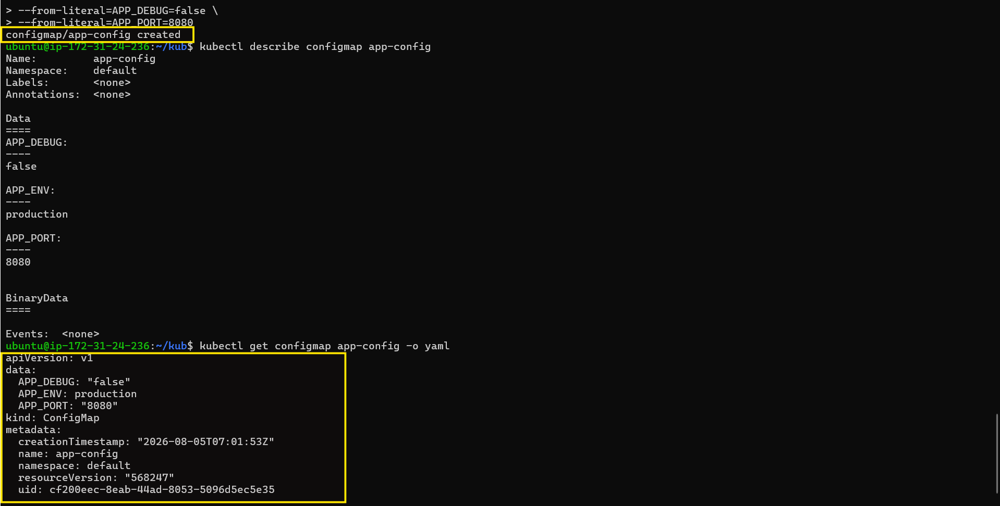
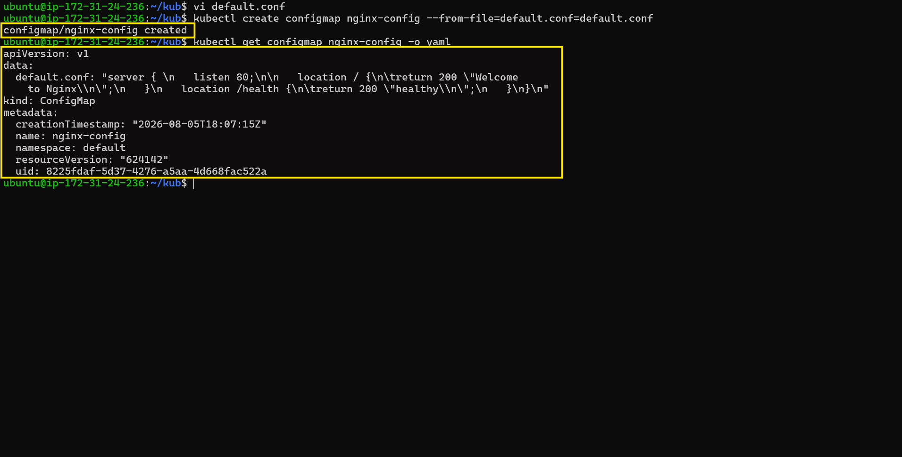
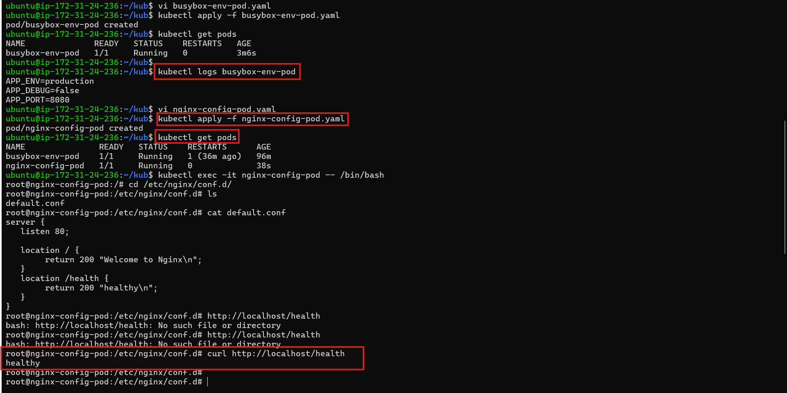
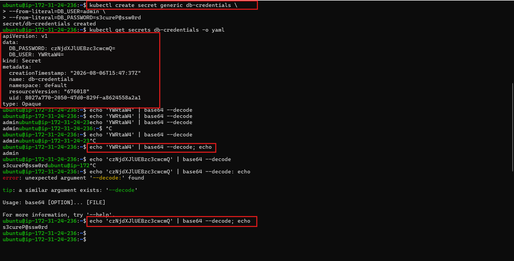
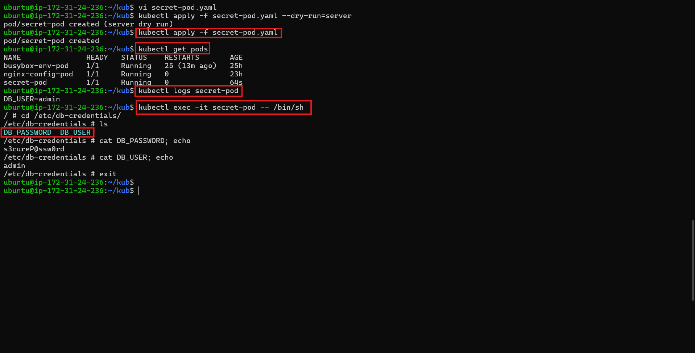
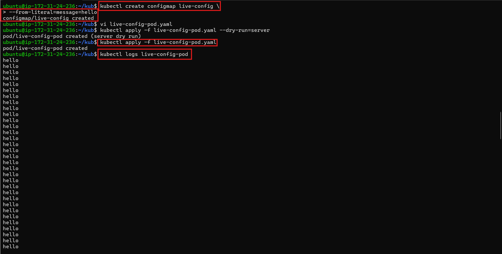
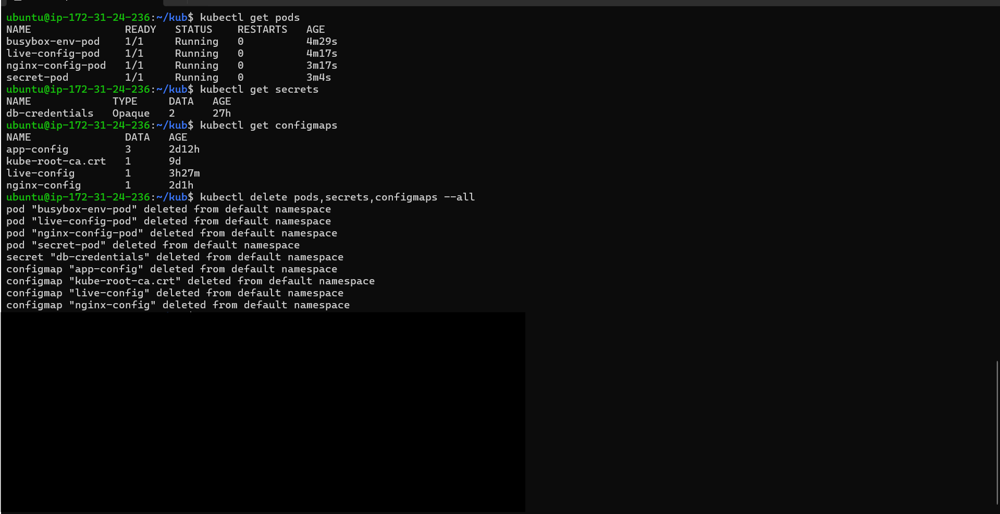

# Day 54 – Kubernetes ConfigMaps and Secrets

## Task

Your application needs configuration — database URLs, feature flags, API keys. Hardcoding these into container images means rebuilding every time a value changes. Kubernetes solves this with ConfigMaps for non-sensitive config and Secrets for sensitive data.

---

## Challenge Tasks

### Task 1: Create a ConfigMap from Literals

Created a ConfigMap called `app-config` using `--from-literal` with the following keys:

* `APP_ENV=production`
* `APP_DEBUG=false`
* `APP_PORT=8080`

Inspected the ConfigMap using:

```bash
kubectl describe configmap app-config
kubectl get configmap app-config -o yaml
```

The values were stored as plain text.

**Verify:** Yes, all three key-value pairs were visible.



---

### Task 2: Create a ConfigMap from a File

Created a custom Nginx configuration file named `default.conf` with a `/health` endpoint returning `healthy`.

Created the ConfigMap using:

```bash
kubectl create configmap nginx-config --from-file=default.conf=default.conf
```

Verified the contents using:

```bash
kubectl get configmap nginx-config -o yaml
```

The `default.conf` key contained the Nginx configuration.

**Verify:** Yes, the file contents were visible in the ConfigMap.



---

### Task 3: Use ConfigMaps in a Pod

Created a BusyBox Pod using `envFrom` and `configMapRef` to inject all keys from `app-config` as environment variables.

Verified the configuration values inside the Pod.

Created a second Pod named `nginx-config-pod` that mounted `nginx-config` as a volume at `/etc/nginx/conf.d`.

Verified the mounted file:

```bash
/etc/nginx/conf.d/default.conf
```

Tested the Nginx configuration:

```bash
curl http://localhost/health
```

Output:

```text
healthy
```

**Verify:** Yes, the `/health` endpoint responded successfully.

Environment variables were used for simple key-value settings, while volume mounts were used for complete configuration files.



---

### Task 4: Create a Secret

Created a Secret named `db-credentials` using:

```bash
kubectl create secret generic db-credentials \
  --from-literal=DB_USER=admin \
  --from-literal=DB_PASSWORD=s3cureP@ssw0rd
```

Inspected the Secret using:

```bash
kubectl get secret db-credentials -o yaml
```

The values appeared Base64-encoded.

Decoded the values and verified:

```text
DB_USER: admin
DB_PASSWORD: s3cureP@ssw0rd
```

**Verify:** Yes, the password was successfully decoded back to plaintext.

Base64 is encoding, not encryption. Anyone with permission to access the Secret can decode the values.




---

### Task 5: Use Secrets in a Pod

Created a Pod named `secret-pod` that injected `DB_USER` using `secretKeyRef`.

Mounted the complete `db-credentials` Secret as a read-only volume at:

```text
/etc/db-credentials
```

Verified that Kubernetes created:

```text
DB_USER
DB_PASSWORD
```

as files inside the mounted directory.

The file contents were:

```text
DB_USER: admin
DB_PASSWORD: s3cureP@ssw0rd
```

**Verify:** The mounted Secret values were plaintext, not Base64-encoded.




---

### Task 6: Update a ConfigMap and Observe Propagation

Created a ConfigMap named `live-config` with:

```text
message=hello
```

Created a Pod that mounted the ConfigMap as a volume and read the value every 5 seconds.

Initially, the Pod output showed:

```text
hello
hello
hello
```

Updated the ConfigMap using:

```bash
kubectl patch configmap live-config --type merge -p '{"data":{"message":"world"}}'
```

After waiting for the update to propagate, the Pod output changed to:

```text
world
world
world
```

The Pod was not restarted.

**Verify:** Yes, the volume-mounted value changed from `hello` to `world` without restarting the Pod.

Environment variables do not receive ConfigMap updates automatically because their values are set when the container starts.




---

### Task 7: Clean Up

Deleted the Pods, ConfigMaps, and Secret created during the task.

The following Day 54 resources were cleaned up:

* `busybox-env-pod`
* `nginx-config-pod`
* `secret-pod`
* `live-config-pod`
* `app-config`
* `nginx-config`
* `live-config`
* `db-credentials`



---

## Documentation

### What are ConfigMaps and Secrets?

**ConfigMaps** store non-sensitive configuration such as application settings, feature flags, and configuration files.

**Secrets** store sensitive information such as database credentials, API keys, and tokens.

ConfigMaps were used for normal configuration, while Secrets were used for sensitive values.

### Environment Variables vs Volume Mounts

Environment variables are suitable for simple key-value configuration.

Volume mounts are suitable when an application requires a complete configuration file, such as an Nginx configuration.

### Base64 Is Encoding, Not Encryption

Kubernetes stores Secret values in Base64-encoded form when retrieved through the API.

Base64 is only an encoding mechanism and can easily be decoded back to plaintext. It does not provide encryption.

### ConfigMap Update Propagation

When a ConfigMap is mounted as a volume, Kubernetes automatically updates the mounted value when the ConfigMap changes.

In this task, the mounted value changed from `hello` to `world` without restarting the Pod.

ConfigMaps used as environment variables do not update automatically because environment variables are set when the container starts.

