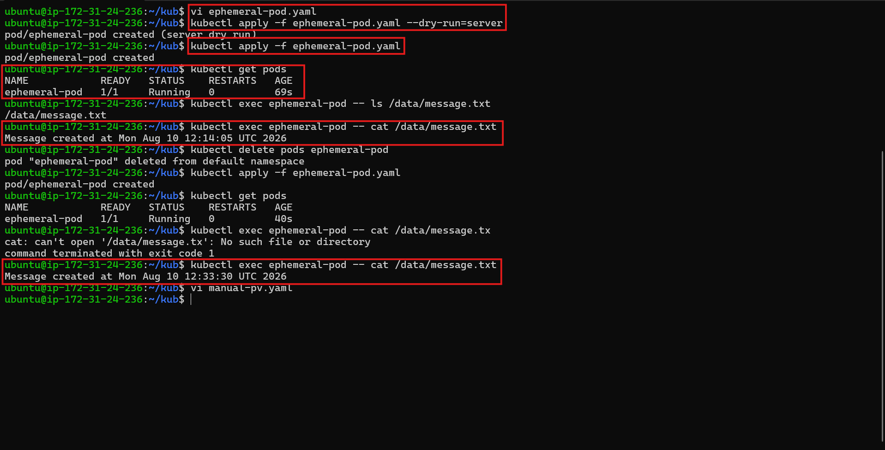
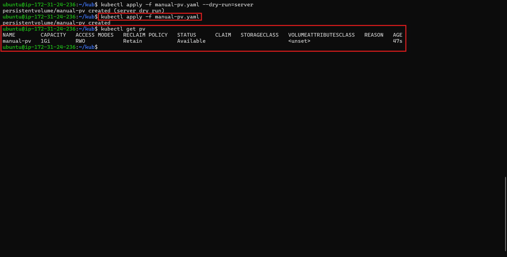
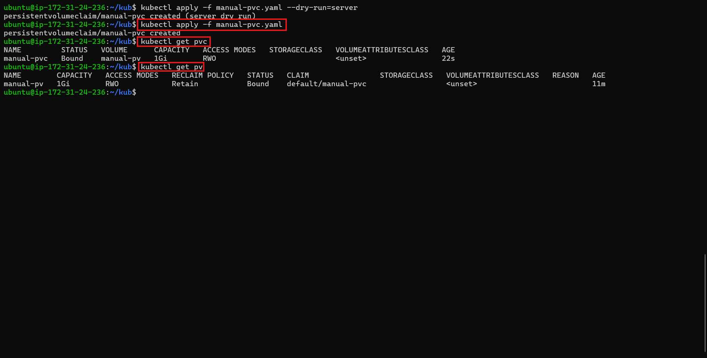
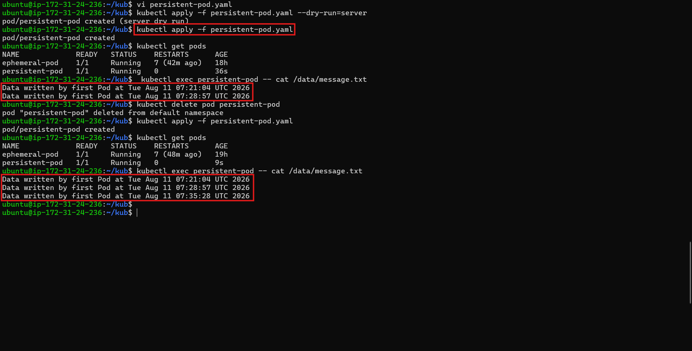
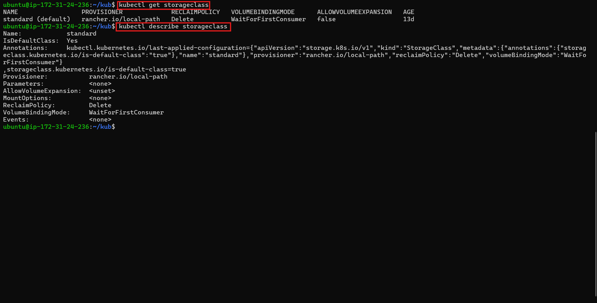
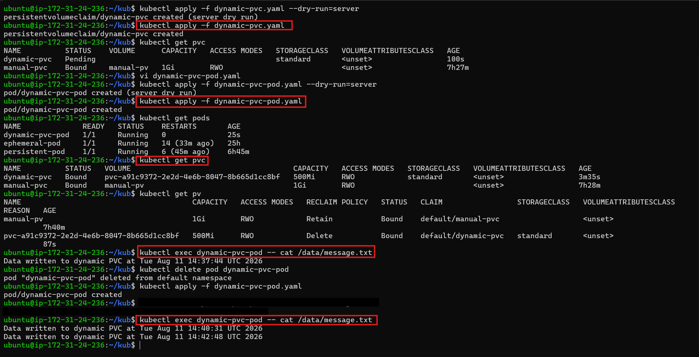
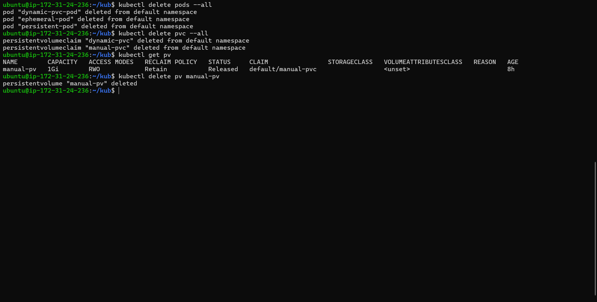

# Day 55 – Persistent Volumes (PV) and Persistent Volume Claims (PVC)

## Task

Demonstrated how Persistent Volumes and Persistent Volume Claims provide storage that survives Pod deletion. Compared ephemeral `emptyDir` storage with persistent storage, created a manually provisioned PV and PVC, verified data persistence, explored StorageClasses and dynamic provisioning, and tested PV reclaim policies.

---

## Challenge Tasks

### Task 1: See the Problem — Data Lost on Pod Deletion

1. Created a Pod manifest using an `emptyDir` volume and wrote a timestamped message to `/data/message.txt`.
2. Applied it and verified the data existed with `kubectl exec`.
3. Deleted and recreated the Pod and verified that the original message was gone.

**Verify:** Is the timestamp the same or different after recreation?

**Answer:** Different. The old data was lost because `emptyDir` storage exists only for the lifetime of the Pod.

---

### Task 2: Create a PersistentVolume (Static Provisioning)

1. Created a PV manifest with `capacity: 1Gi`, `accessModes: ReadWriteOnce`, `persistentVolumeReclaimPolicy: Retain`, and `hostPath` pointing to `/tmp/k8s-pv-data`.
2. Applied it and verified the PV status.

Access modes to know:

* `ReadWriteOnce (RWO)` — read-write by a single node
* `ReadOnlyMany (ROX)` — read-only by many nodes
* `ReadWriteMany (RWX)` — read-write by many nodes

`hostPath` is fine for learning, not for production.

**Verify:** What is the STATUS of the PV?

**Answer:** `Available`

---

### Task 3: Create a PersistentVolumeClaim

1. Created a PVC manifest requesting `500Mi` of storage with `ReadWriteOnce` access.
2. Applied it and checked both the PVC and PV.
3. Verified that both were `Bound` and Kubernetes matched them by capacity and access mode.

**Verify:** What does the VOLUME column in `kubectl get pvc` show?

**Answer:** `manual-pv`

---

### Task 4: Use the PVC in a Pod — Data That Survives

1. Created a Pod manifest that mounted the PVC at `/data` using `persistentVolumeClaim.claimName`.
2. Wrote data to `/data/message.txt`, deleted and recreated the Pod.
3. Verified that the file retained data across Pod deletions and recreations.

**Verify:** Does the file contain data from both the first and second Pod?

**Answer:** Yes. The file contained data from multiple Pod instances because the data was stored on the PersistentVolume.

---

### Task 5: StorageClasses and Dynamic Provisioning

1. Inspected the available StorageClass and its configuration.
2. Verified the provisioner, reclaim policy, and volume binding mode.
3. Confirmed that dynamic provisioning allows a PVC to trigger automatic PV creation through the StorageClass.

**Verify:** What is the default StorageClass in your cluster?

**Answer:** `standard`

---

### Task 6: Dynamic Provisioning

1. Created a PVC manifest with `storageClassName: standard`.
2. Applied it and verified that a PV was automatically created after the PVC had a consumer.
3. Used the dynamically provisioned PVC in a Pod and verified that data could be written to and read from the persistent storage.

**Verify:** How many PVs exist now? Which was manual, which was dynamic?

**Answer:** Two PVs existed. `manual-pv` was manually created, while `pvc-a91c9372-2e2d-4e6b-8047-8b665d1cc8bf` was dynamically created by the `standard` StorageClass.

---

### Task 7: Clean Up

1. Deleted all Pods first.
2. Deleted all PVCs and checked the PVs.
3. Verified that the dynamic PV was automatically deleted and the manual PV changed to `Released`.
4. Deleted the remaining manual PV manually.

**Verify:** Which PV was auto-deleted and which was retained? Why?

**Answer:** The dynamic PV was auto-deleted because its reclaim policy was `Delete`. The manual PV was retained and changed to `Released` because its reclaim policy was `Retain`. The remaining manual PV was then deleted manually.

---

* **Why containers need persistent storage:** Container and Pod storage is ephemeral, so data can be lost when a Pod is deleted or recreated. Persistent storage keeps important data available beyond the Pod lifecycle.
* **What PVs and PVCs are and how they relate:** A PersistentVolume (PV) provides cluster storage, while a PersistentVolumeClaim (PVC) requests storage. Kubernetes binds a suitable PV to the PVC.
* **Static vs dynamic provisioning:** Static provisioning uses a manually created PV. Dynamic provisioning uses a StorageClass to automatically create a PV when a PVC requests storage.
* **Access modes and reclaim policies:** `ReadWriteOnce (RWO)` allows read-write access from a single node. `ReadOnlyMany (ROX)` allows read-only access from many nodes. `ReadWriteMany (RWX)` allows read-write access from many nodes. `Retain` keeps the PV after PVC deletion, while `Delete` automatically removes dynamically provisioned storage.

---
