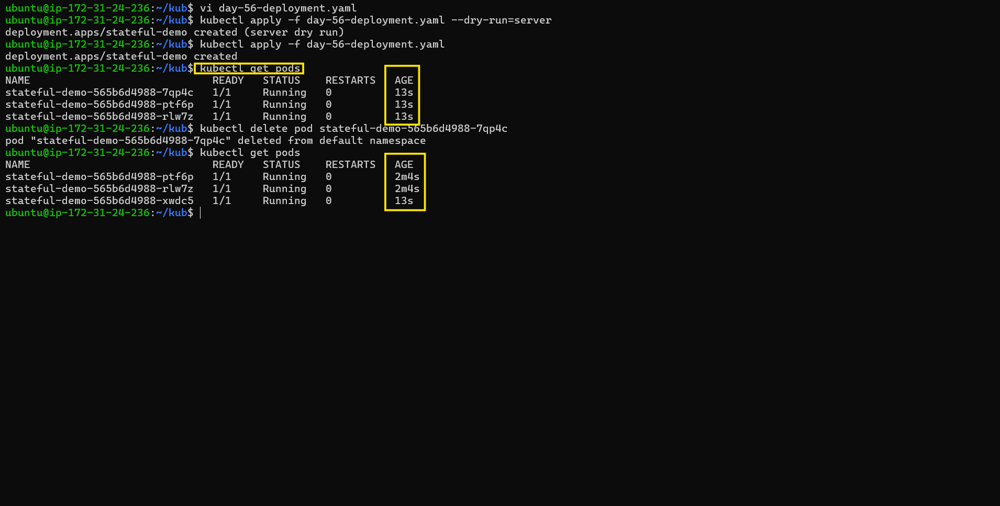
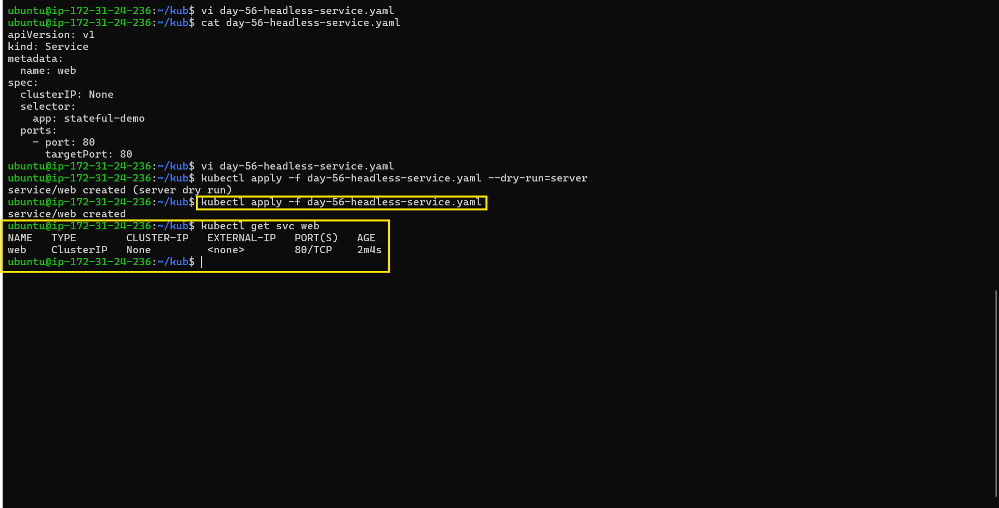
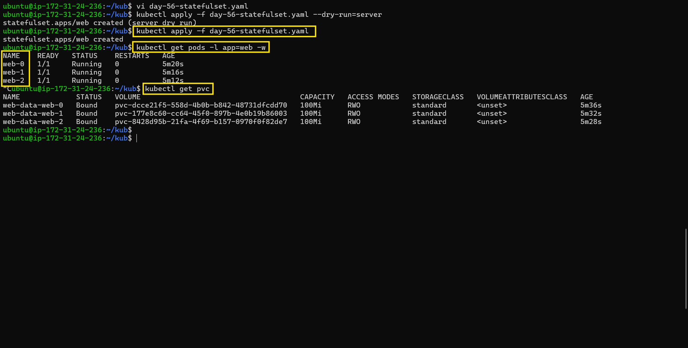
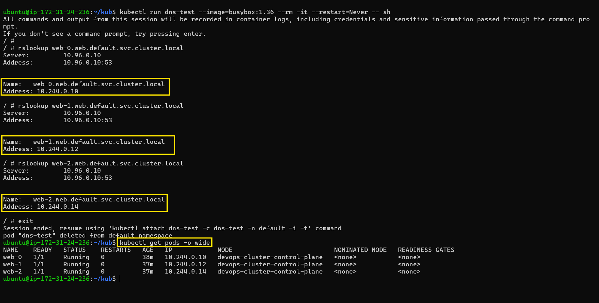
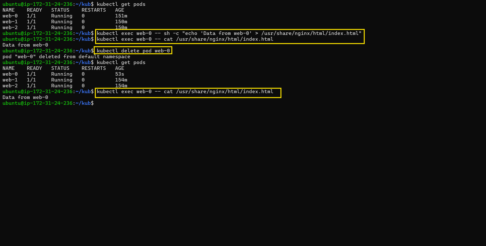
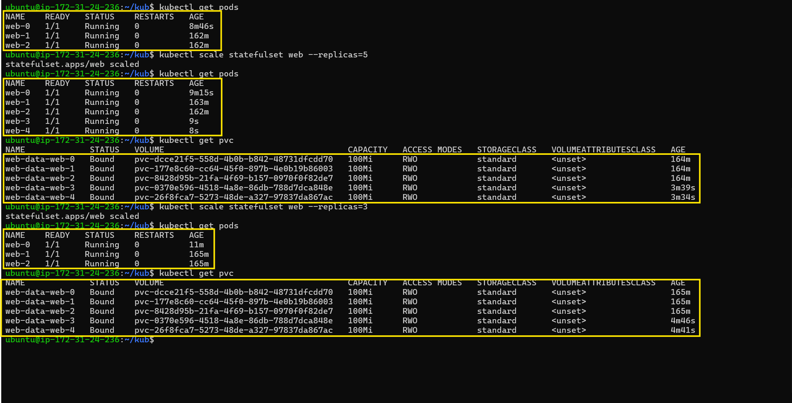
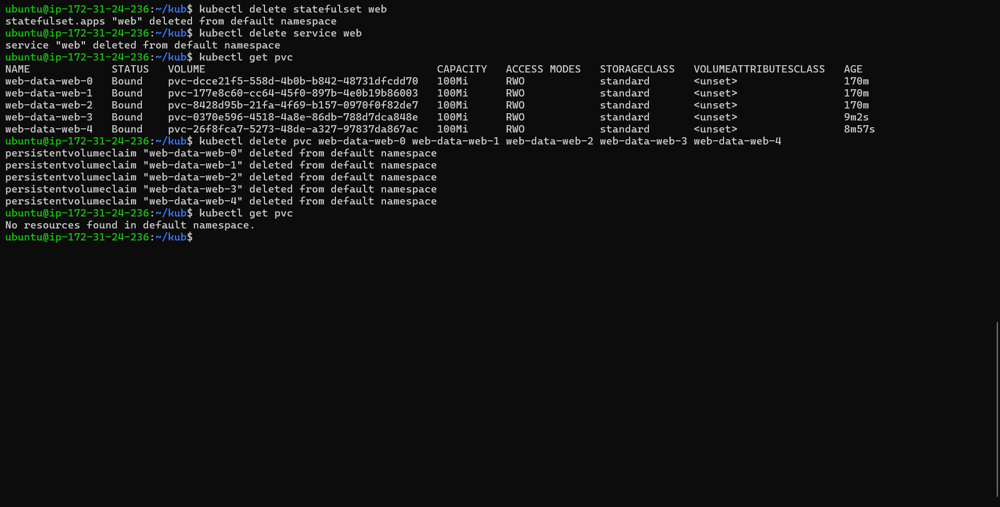

# Day 56 – Kubernetes StatefulSets

## Task

Demonstrated how StatefulSets provide stable Pod names, ordered startup, stable network identity, and persistent storage for stateful applications.

---

## Challenge Tasks

### Task 1: Understand the Problem

1. Created a Deployment with 3 replicas using nginx.
2. Checked the Pod names and confirmed they were random.
3. Deleted a Pod and observed that the replacement received a different random name.

This demonstrated why stable identity is important for database clusters.

| **FeatureDeploymentStatefulSet** |                    |                                        |
| -------------------------------- | ------------------ | -------------------------------------- |
| Pod names                        | Random             | Stable, ordered (`app-0`, `app-1`)     |
| Startup order                    | All at once        | Ordered: pod-0, then pod-1, then pod-2 |
| Storage                          | Shared PVC         | Each pod gets its own PVC              |
| Network identity                 | No stable hostname | Stable DNS per pod                     |

Deleted the Deployment before moving on.

**Verify:** Why would random pod names be a problem for a database cluster?

Random Pod names make stable database node identity and node-to-node communication difficult.

---

### Task 2: Create a Headless Service

1. Created a Service manifest with `clusterIP: None`.
2. Set the selector to match the StatefulSet Pod labels.
3. Applied it and confirmed it was a Headless Service.

A Headless Service provided individual DNS entries for StatefulSet Pods.

**Verify:** What does the CLUSTER-IP column show?

`None`

---

### Task 3: Create a StatefulSet

1. Created a StatefulSet manifest with `serviceName` pointing to the Headless Service.
2. Set replicas to 3 and used the nginx image.
3. Added a `volumeClaimTemplates` section requesting 100Mi of ReadWriteOnce storage.
4. Applied the StatefulSet and observed ordered Pod creation.
5. Verified the PVCs were created and bound.

**Verify:** What are the exact pod names and PVC names?

Pod names:

* `web-0`
* `web-1`
* `web-2`

PVC names:

* `web-data-web-0`
* `web-data-web-1`
* `web-data-web-2`

---

### Task 4: Stable Network Identity

Each StatefulSet pod gets a DNS name: `<pod-name>.<service-name>.<namespace>.svc.cluster.local`

1. Ran a temporary BusyBox Pod and used `nslookup` to resolve `web-0.web.default.svc.cluster.local`.
2. Resolved `web-1.web.default.svc.cluster.local` and `web-2.web.default.svc.cluster.local`.
3. Confirmed the DNS IPs matched the Pod IPs from `kubectl get pods -o wide`.

**Verify:** Does the nslookup IP match the pod IP?

Yes. The DNS IPs matched the corresponding Pod IPs.

---

### Task 5: Stable Storage — Data Survives Pod Deletion

1. Wrote unique data to `web-0`.
2. Deleted `web-0`.
3. Waited for `web-0` to be recreated.
4. Verified that the original data was still present.

The recreated Pod reconnected to the same PVC.

**Verify:** Is the data identical after pod recreation?

Yes. The data remained `Data from web-0`.

---

### Task 6: Ordered Scaling

1. Scaled the StatefulSet from 3 to 5 replicas.
2. Observed `web-3` and `web-4` being created in order.
3. Scaled the StatefulSet back down to 3 replicas.
4. Verified that `web-3` and `web-4` Pods were removed while their PVCs remained.
5. Confirmed that all five PVCs still existed after scaling down.

**Verify:** After scaling down, how many PVCs exist?

5 PVCs existed.

---

### Task 7: Clean Up

1. Deleted the StatefulSet and the Headless Service.
2. Checked the PVCs and confirmed they were still present.
3. Manually deleted all five PVCs.
4. Verified that no PVCs remained.

**Verify:** Were PVCs auto-deleted with the StatefulSet?

No. PVCs were retained after StatefulSet deletion and had to be deleted manually.

---

## Key Learnings

### What StatefulSets Are and When to Use Them

StatefulSets are Kubernetes workloads designed for applications that need **stable Pod identity, ordered startup, stable networking, and persistent storage**.

Use **Deployments** for stateless applications such as web servers and APIs. Use **StatefulSets** for stateful applications such as databases, Kafka, and clustered applications where each replica needs its own identity and storage.

### Deployment vs StatefulSet

| Feature          | Deployment                   | StatefulSet                           |
| ---------------- | ---------------------------- | ------------------------------------- |
| Pod names        | Random                       | Stable and ordered (`web-0`, `web-1`) |
| Startup order    | Independent                  | Ordered                               |
| Storage          | Shared/configured separately | Individual PVC per Pod                |
| Network identity | No stable Pod hostname       | Stable Pod DNS                        |
| Pod replacement  | New random identity          | Same ordinal identity                 |
| Scaling          | Pods are interchangeable     | Each replica has unique identity      |

### Headless Services, Stable DNS, and `volumeClaimTemplates`

A **Headless Service** uses `clusterIP: None` and provides DNS records for individual StatefulSet Pods.

Each Pod gets a stable DNS name:

`web-0.web.default.svc.cluster.local`

The Pod IP can change, but its DNS identity remains stable.

`volumeClaimTemplates` creates a separate PVC for each StatefulSet replica:

* `web-data-web-0`
* `web-data-web-1`
* `web-data-web-2`

This allows each Pod to retain its own data when the Pod is deleted and recreated.

### Screenshots

## added above

* **Pods:** `web-0`, `web-1`, and `web-2` showing stable Pod names.
* **PVCs:** Individual PVCs created for each StatefulSet replica.
* **DNS resolution:** Successful `nslookup` results for `web-0`, `web-1`, and `web-2`, with resolved IPs matching the Pod IPs.

