# Day 57 – Resource Requests, Limits, and Probes

## Task 1: Resource Requests and Limits
1. Write a Pod manifest with `resources.requests` (cpu: 100m, memory: 128Mi) and `resources.limits` (cpu: 250m, memory: 256Mi)
2. Apply and inspect with `kubectl describe pod` — look for the Requests, Limits, and QoS Class sections
3. Since requests and limits differ, the QoS class is `Burstable`. If equal, it would be `Guaranteed`. If missing, `BestEffort`.

CPU is in millicores: `100m` = 0.1 CPU. Memory is in mebibytes: `128Mi`.

**Requests** = guaranteed minimum (scheduler uses this for placement). **Limits** = maximum allowed (kubelet enforces at runtime).

   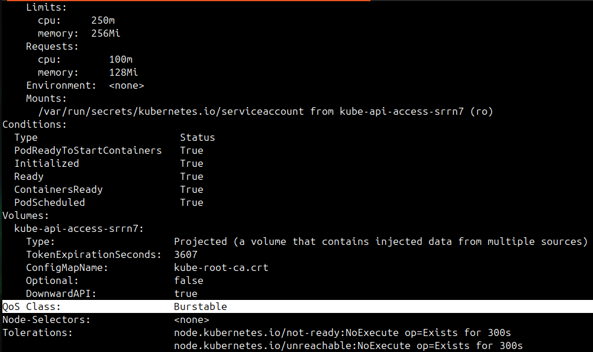

**Verify:** What QoS class does your Pod have?
**Burstable**

---

## Task 2: OOMKilled — Exceeding Memory Limits
1. Write a Pod manifest using the `polinux/stress` image with a memory limit of `100Mi`
2. Set the stress command to allocate 200M of memory: `command: ["stress"] args: ["--vm", "1", "--vm-bytes", "200M", "--vm-hang", "1"]`
3. Apply and watch — the container gets killed immediately

   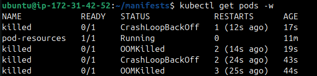

CPU is throttled when over limit. Memory is killed — no mercy.

Check `kubectl describe pod` for `Reason: OOMKilled` and `Exit Code: 137` (128 + SIGKILL).

   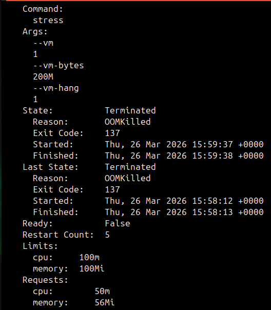

**Verify:** What exit code does an OOMKilled container have? - **137**

---

## Task 3: Pending Pod — Requesting Too Much
1. Write a Pod manifest requesting `cpu: 100` and `memory: 128Gi`
2. Apply and check — STATUS stays `Pending` forever

   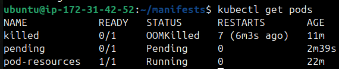

3. Run `kubectl describe pod` and read the Events — the scheduler says exactly why: insufficient resources

   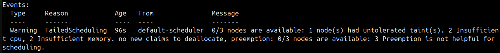

**Verify:** What event message does the scheduler produce?
   - Type: Warning
   - Reason: FailedScheduling
   - Message: 0/3 nodes are available: 1 node(s) had untolerated taint(s), 2 Insufficient 
     cpu, 2 Insufficient memory. no new claims to deallocate, preemption: 0/3 nodes are available: 3 Preemption is not helpful for scheduling.

---

## Task 4: Liveness Probe
A liveness probe detects stuck containers. If it fails, Kubernetes restarts the container.

1. Write a Pod manifest with a busybox container that creates `/tmp/healthy` on startup, then deletes it after 30 seconds
2. Add a liveness probe using `exec` that runs `cat /tmp/healthy`, with `periodSeconds: 5` and `failureThreshold: 3`
3. After the file is deleted, 3 consecutive failures trigger a restart. Watch with `kubectl get pod -w`

   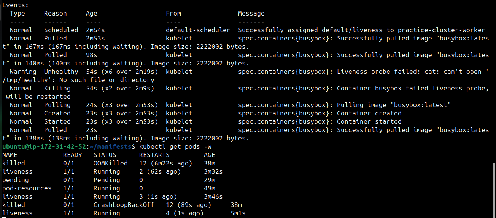

**Verify:** How many times has the container restarted?
   * After retrying 3 times it says `cat: can't open '/tmp/healthy': No such file or directory` and kills the container and keeps restarting again. As for now total 6 restarts.

---

## Task 5: Readiness Probe
A readiness probe controls traffic. Failure removes the Pod from Service endpoints but does NOT restart it.

1. Write a Pod manifest with nginx and a `readinessProbe` using `httpGet` on path `/` port `80`
2. Expose it as a Service: `kubectl expose pod <name> --port=80 --name=readiness-svc`
3. Check `kubectl get endpoints readiness-svc` — the Pod IP is listed
4. Break the probe: `kubectl exec <pod> -- rm /usr/share/nginx/html/index.html`
5. Wait 15 seconds — Pod shows `0/1` READY, endpoints are empty, but the container is NOT restarted

   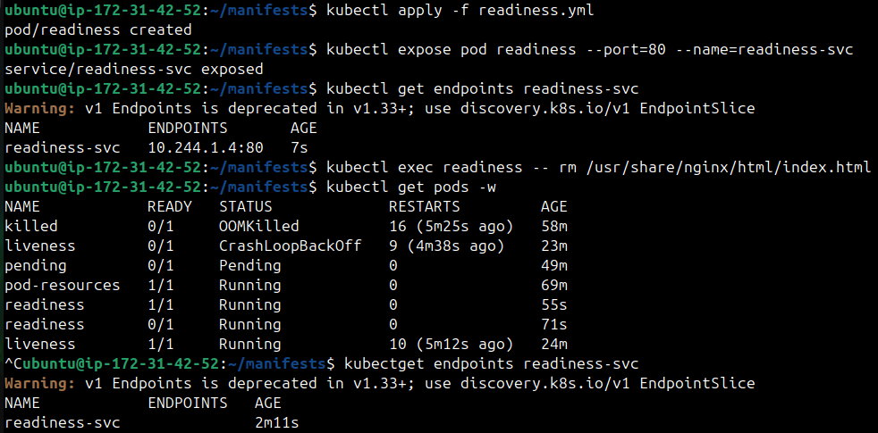

   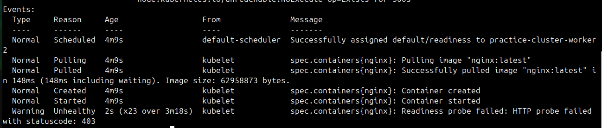

**Verify:** When readiness failed, was the container restarted?
   * `No` container was not restarted.

---

## Task 6: Startup Probe
A startup probe gives slow-starting containers extra time. While it runs, liveness and readiness probes are disabled.

1. Write a Pod manifest where the container takes 20 seconds to start (e.g., `sleep 20 && touch /tmp/started`)
2. Add a `startupProbe` checking for `/tmp/started` with `periodSeconds: 5` and `failureThreshold: 12` (60 second budget)
3. Add a `livenessProbe` that checks the same file — it only kicks in after startup succeeds

   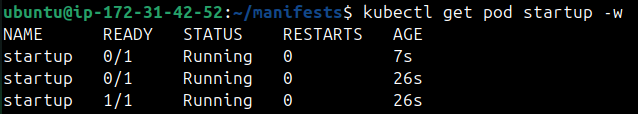

   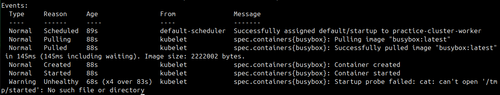

**Verify:** What would happen if `failureThreshold` were 2 instead of 12?

   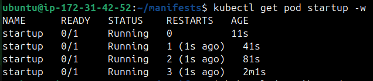

   - Changed `failureThreshold` from 12 to 2 and pod kept startup probe kept failing, pod 
     killed and kept restarting. Because we take 20 sec to create `/tmp/started` &
     startup probe (2*5) check 2 times in 10sec so the file is never created and it keeps
     failing.

---

### Task 7: Clean Up
Delete all pods and services you created.

   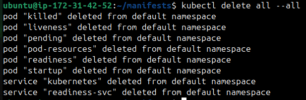

---

- Requests vs limits (scheduling vs enforcement)
   * `Requests` : 
      - The minimum amount of CPU/memory a container is guaranteed.
      - Kubernetes uses requests during scheduling: the scheduler ensures the node has at 
        least that much capacity before placing the pod.
   * `Limits` : 
      - The maximum amount of CPU/memory a container can use.
      - Enforced at runtime by the kubelet. If the container tries to exceed the limit,
        it gets throttled (CPU) or killed (OOM for memory).

- What happens when CPU or memory limits are exceeded
   * **CPU** - Container is throttled (slowed down, not killed)
   * **Memory** - Container is killed (OOMKilled) and restarted

- Liveness vs readiness vs startup probes

| Probe Type | Purpose | Action | Use case | In short |
|------------|---------|--------|----------|----------|
| Liveness | Checks if the container is still alive | if failed, restart the container | Detects deadlocks or crashes where the app is running but not functioning | Is the app still running? |
| Readiness | Checks if the container is ready to server traffic | if failed, remove the pod from Service endpoints (no traffic routed to it). | Ensures only healthy pods receive requests | Is the app ready to serve traffic |
| Startup | Gives container time to initialize before other probes run | if failed, kill and restart the container | Useful for apps with long startup times, preventing premature liveness/readiness failures | Has the app started yet? |

---
