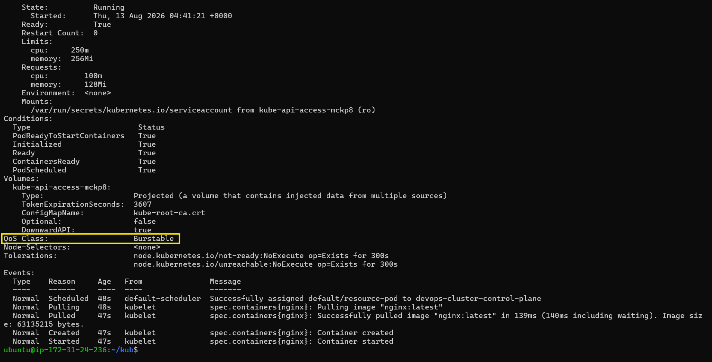
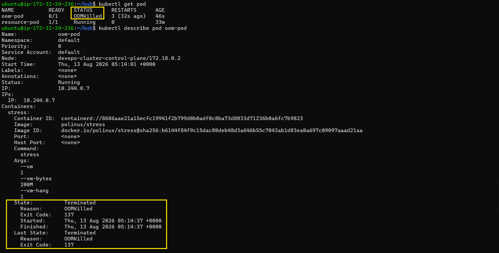
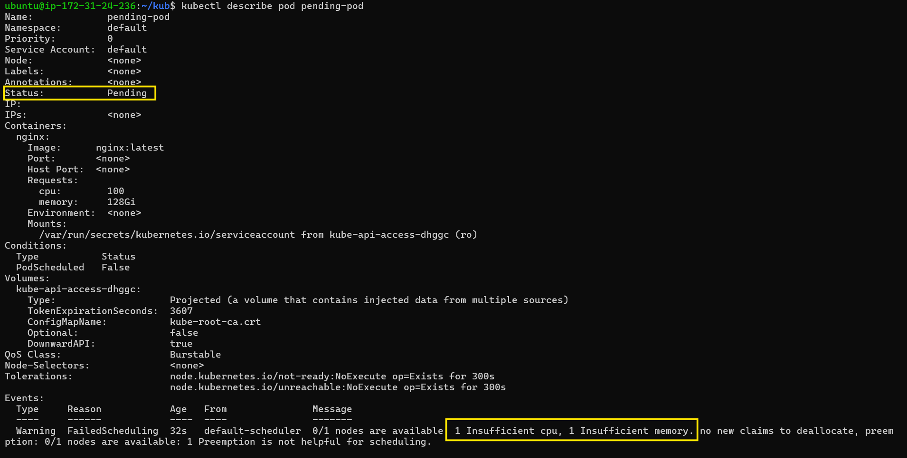
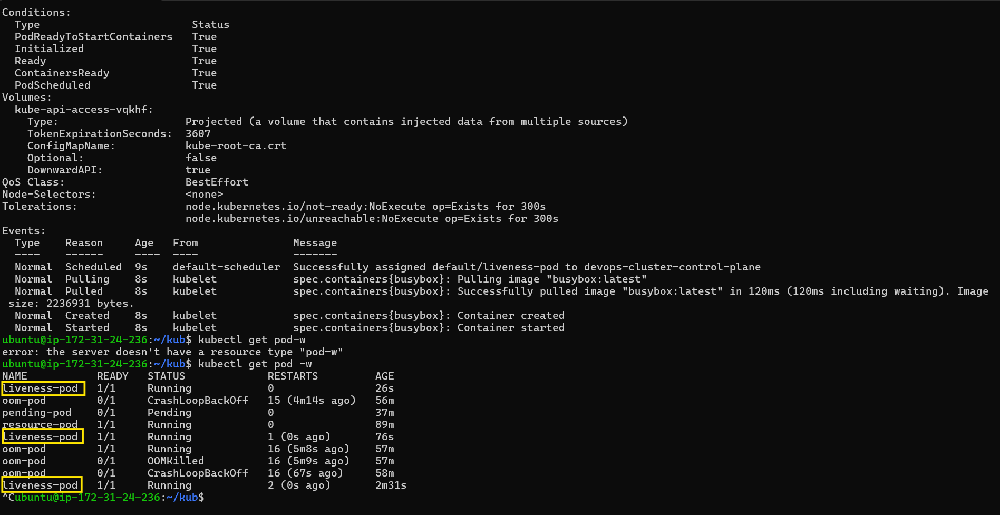
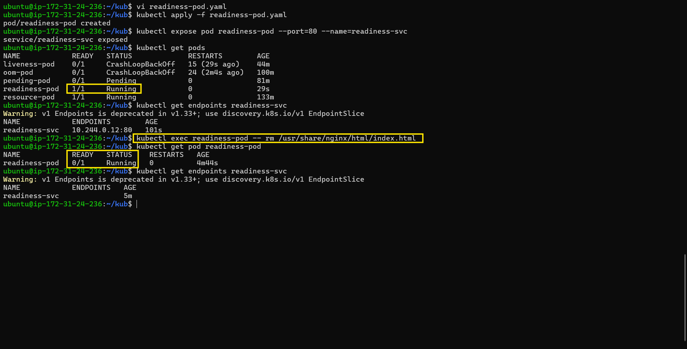
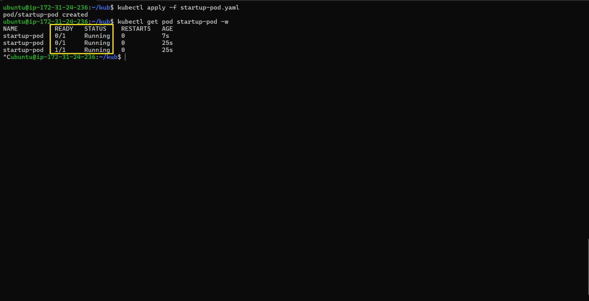
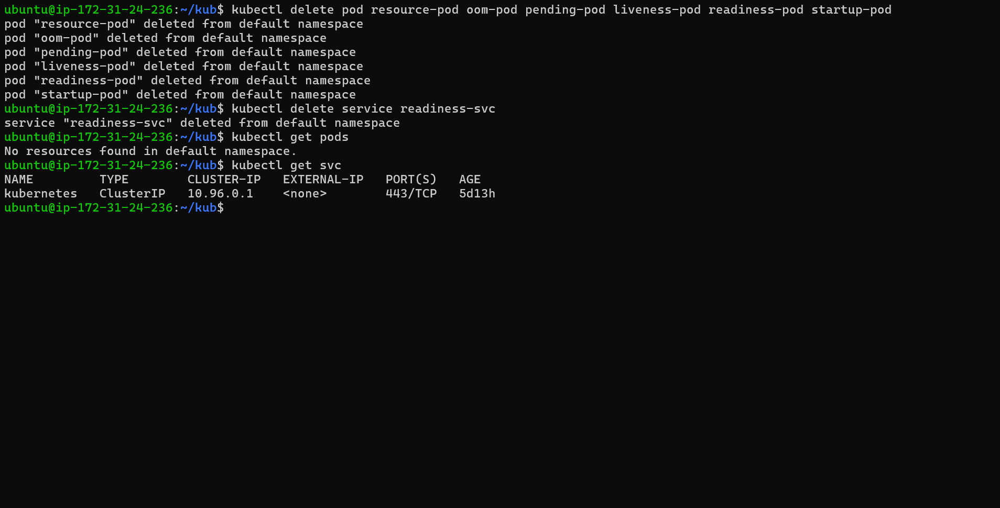

# Day 57 – Resource Requests, Limits, and Probes

## Task

Set resource requests and limits for smart scheduling and added probes so Kubernetes could detect and recover from container failures.

---

## Challenge Tasks

### Task 1: Resource Requests and Limits

1. Created a Pod manifest with `resources.requests` (`cpu: 100m`, `memory: 128Mi`) and `resources.limits` (`cpu: 250m`, `memory: 256Mi`).
2. Applied the manifest and inspected the Pod using `kubectl describe pod`, verifying Requests, Limits, and QoS Class.
3. Confirmed that the QoS class was `Burstable`.

CPU was configured in millicores: `100m` = 0.1 CPU. Memory was configured in mebibytes: `128Mi`.

**Requests** = minimum resources used by the scheduler for Pod placement. **Limits** = maximum resources enforced at runtime.

**Verify:** What QoS class does your Pod have?

**Answer:** `Burstable`

---

### Task 2: OOMKilled — Exceeding Memory Limits

1. Created a Pod using the `polinux/stress` image with a memory limit of `100Mi`.
2. Configured the stress command to allocate `200M` of memory.
3. Applied and monitored the Pod and observed the container being killed.

CPU was throttled when exceeding its limit, while exceeding the memory limit caused the container to be killed.

The Pod showed `Reason: OOMKilled` and `Exit Code: 137`.

**Verify:** What exit code does an OOMKilled container have?

**Answer:** `137`

---

### Task 3: Pending Pod — Requesting Too Much

1. Created a Pod requesting `cpu: 100` and `memory: 128Gi`.
2. Applied the manifest and observed that the Pod remained `Pending`.
3. Inspected the Pod Events and confirmed that the scheduler could not place it because of insufficient resources.

**Verify:** What event message does the scheduler produce?

**Answer:** `0/1 nodes are available: 1 Insufficient cpu, 1 Insufficient memory.`

---

### Task 4: Liveness Probe

A liveness probe was used to detect a stuck container and restart it when the health check failed.

1. Created a BusyBox Pod that created `/tmp/healthy` on startup and deleted it after 30 seconds.
2. Added an `exec` liveness probe using `cat /tmp/healthy`, with `periodSeconds: 5` and `failureThreshold: 3`.
3. Watched the Pod and observed Kubernetes restarting the container after consecutive probe failures.

**Verify:** How many times has the container restarted?

**Answer:** The container restarted multiple times; the observed restart count reached `2` during verification.

---

### Task 5: Readiness Probe

A readiness probe was used to control Service traffic. Failure removed the Pod from Service endpoints without restarting the container.

1. Created an nginx Pod with a `readinessProbe` using `httpGet` on path `/` and port `80`.
2. Exposed the Pod as `readiness-svc`.
3. Verified that the Pod IP was initially listed in the Service endpoints.
4. Removed `/usr/share/nginx/html/index.html` to make the readiness probe fail.
5. Verified that the Pod became `0/1 Ready`, the Service endpoints became empty, and the container was not restarted.

**Verify:** When readiness failed, was the container restarted?

**Answer:** No. The container remained running and the restart count stayed at `0`.

---

### Task 6: Startup Probe

A startup probe was used to give a slow-starting container extra time to initialize.

1. Created a Pod where the container took 20 seconds to create `/tmp/started`.
2. Added a `startupProbe` checking `/tmp/started` with `periodSeconds: 5` and `failureThreshold: 12`.
3. Added a `livenessProbe` checking the same file and verified that the Pod became ready after startup succeeded.

**Verify:** What would happen if `failureThreshold` were 2 instead of 12?

**Answer:** The startup probe would allow only about 10 seconds for the application to start. Since the container needed 20 seconds, the startup probe would fail and Kubernetes would restart the container before startup completed.

---

### Task 7: Clean Up

Deleted all Pods and the Service created during the task.

Verified that no Pods remained in the default namespace and that only the default Kubernetes `kubernetes` Service remained.

---

## Key Takeaways

### Requests vs Limits

* **Requests** → minimum resources used by the scheduler for Pod placement.
* **Limits** → maximum resources enforced at runtime by the kubelet.
* Configured CPU request as `100m` and limit as `250m`.
* Configured memory request as `128Mi` and limit as `256Mi`.
* Since requests and limits differed, the Pod had **`Burstable` QoS**.

### What Happens When Limits Are Exceeded?

* **CPU limit exceeded** → CPU usage is throttled.
* **Memory limit exceeded** → the container can be terminated with `OOMKilled`.
* Observed `OOMKilled` with **Exit Code `137`** when the container exceeded its memory limit.

### Liveness vs Readiness vs Startup Probes

| Probe         | Purpose                                         | Failure Behavior                               |
| ------------- | ----------------------------------------------- | ---------------------------------------------- |
| **Liveness**  | Detects unhealthy or stuck containers           | Container is restarted                         |
| **Readiness** | Controls whether a Pod receives Service traffic | Pod is removed from Service endpoints          |
| **Startup**   | Gives slow-starting applications extra time     | Container is killed/restarted if startup fails |

### Screenshots are above 

* **OOMKilled:** Screenshot showing `Reason: OOMKilled` and `Exit Code: 137`.
* **Pending Pod:** Screenshot showing `Insufficient cpu` and `Insufficient memory`.
* **Liveness Probe:** Screenshot showing the container restart count increasing.
* **Readiness Probe:** Screenshot showing `0/1 Ready` and empty Service endpoints.
* **Startup Probe:** Screenshot showing the Pod becoming `1/1 Running` after startup succeeds.

