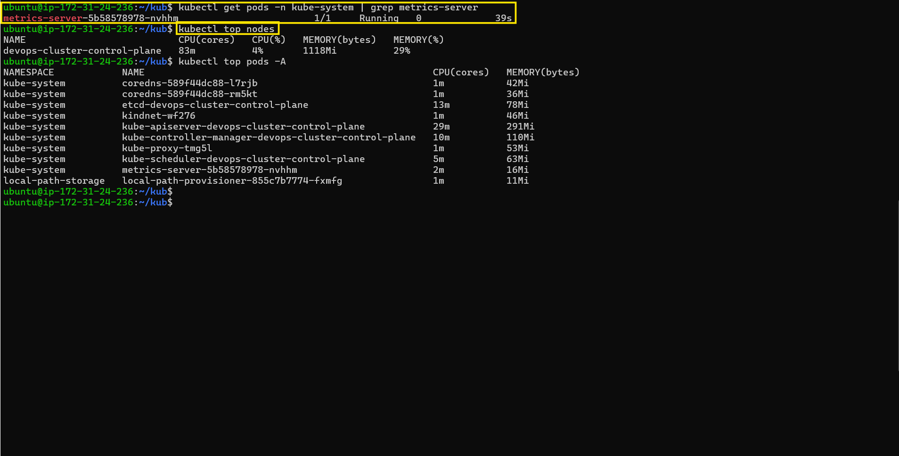
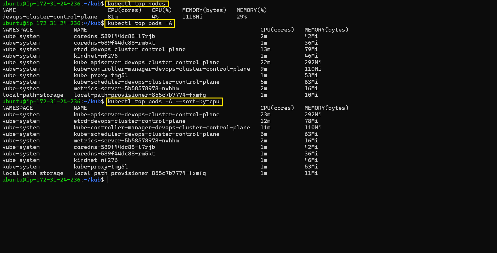
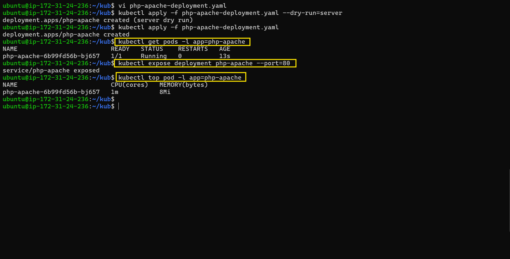
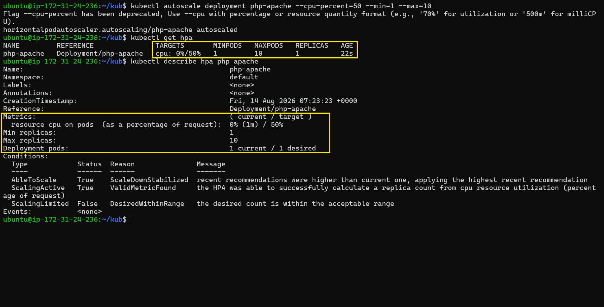
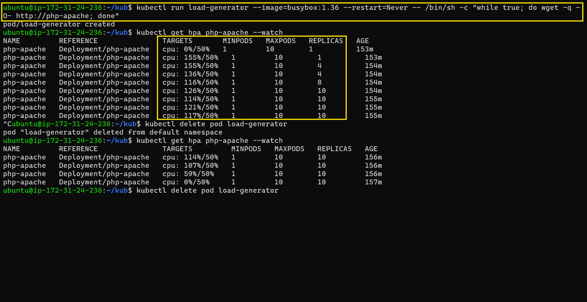
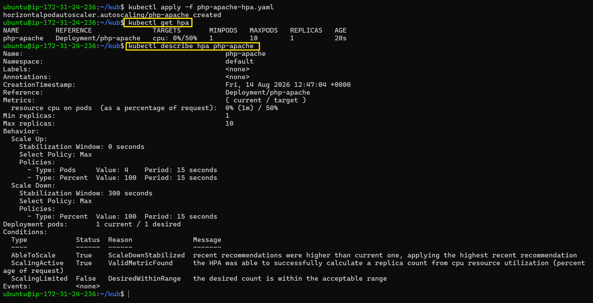
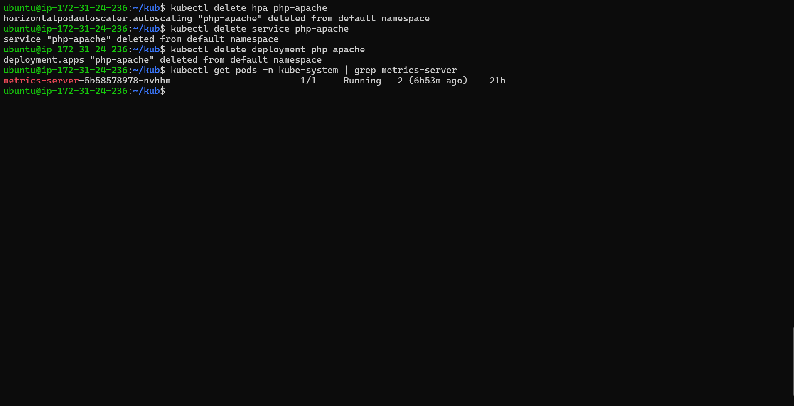

# Day 58 – Metrics Server and Horizontal Pod Autoscaler (HPA)

## Task

Yesterday, resource requests and limits were configured. Today, they were put to work by installing the Metrics Server so Kubernetes could see actual resource usage and configuring a Horizontal Pod Autoscaler (HPA) to automatically scale the application under load.

---

## Expected Output

---

## Challenge Tasks

### Task 1: Install the Metrics Server

1. Checked whether the Metrics Server was already running:

   ```bash
   kubectl get pods -n kube-system | grep metrics-server
   ```

   No Metrics Server Pod was initially found.

2. Installed the official Metrics Server manifest for the kind cluster.

3. The Metrics Server initially remained in `0/1 Running` state. The Pod logs showed a kubelet TLS certificate error:

   ```text
   tls: failed to verify certificate: x509: cannot validate certificate for 172.18.0.2 because it doesn't contain any IP SANs
   ```

   The Metrics Server was configured with the `--kubelet-insecure-tls` flag for the local kind cluster.

   > **Note:** `--kubelet-insecure-tls` was used only for this local lab environment and should not be used in production.

4. After the configuration change, the Metrics Server became ready:

   ```text
   metrics-server-5b58578978-nvhhm   1/1   Running
   ```

5. Verified the Metrics Server using:

   ```bash
   kubectl top nodes
   kubectl top pods -A
   ```

**Verify:** What is the current CPU and memory usage of your node?

> The node was using **83m CPU (4%)** and **1118Mi memory (29%)**.



---

### Task 2: Explore kubectl top

1. Ran the following commands to inspect actual resource usage:

   ```bash
   kubectl top nodes
   kubectl top pods -A
   kubectl top pods -A --sort-by=cpu
   ```

2. Verified that `kubectl top` displayed actual CPU and memory usage rather than configured resource requests or limits.

3. The resource metrics were provided by the Metrics Server, which collects usage data from the kubelets.

**Verify:** Which pod is using the most CPU right now?

> The `kube-apiserver-devops-cluster-control-plane` Pod was using the most CPU, at **29m CPU**.



---

### Task 3: Create a Deployment with CPU Requests

1. Created a Deployment manifest using the `registry.k8s.io/hpa-example` image.

   **Filename:** `php-apache-deployment.yaml`

2. Configured the Deployment with a CPU request of `200m`:

   ```yaml
   resources:
     requests:
       cpu: 200m
   ```

   The CPU request was required so that the HPA could calculate CPU utilization as a percentage of the requested CPU.

3. Applied the Deployment and verified that the Pod was running:

   ```text
   php-apache-6b99fd56b-bj657   1/1   Running
   ```

4. Exposed the Deployment as a Service:

   ```bash
   kubectl expose deployment php-apache --port=80
   ```

5. Checked the Pod's actual resource usage:

   ```bash
   kubectl top pod -l app=php-apache
   ```

**Verify:** What is the current CPU usage of the Pod?

> The `php-apache` Pod was using **1m CPU** and **8Mi memory**.



---

### Task 4: Create an HPA (Imperative)

1. Created an HPA using:

   ```bash
   kubectl autoscale deployment php-apache --cpu-percent=50 --min=1 --max=10
   ```

   Kubernetes displayed a deprecation warning for `--cpu-percent`, but the HPA was created successfully.

2. Checked the HPA using:

   ```bash
   kubectl get hpa
   kubectl describe hpa php-apache
   ```

3. The HPA successfully received CPU metrics and calculated the desired replica count.

   The HPA initially showed:

   ```text
   TARGETS   cpu: 0%/50%
   MINPODS   1
   MAXPODS   10
   REPLICAS  1
   ```

**Verify:** What does the TARGETS column show?

> The TARGETS column showed **`cpu: 0%/50%`**, meaning the current CPU utilization was approximately **0%** and the target CPU utilization was **50%**.



---

### Task 5: Generate Load and Watch Autoscaling

1. Started a load generator using:

   ```bash
   kubectl run load-generator --image=busybox:1.36 --restart=Never -- /bin/sh -c "while true; do wget -q -O- http://php-apache; done"
   ```

2. Watched the HPA using:

   ```bash
   kubectl get hpa php-apache --watch
   ```

3. Under load, CPU utilization increased above the 50% target. The HPA scaled the Deployment as follows:

   ```text
   1 → 4 → 8 → 10 replicas
   ```

4. CPU utilization reached **155%/50%**, and the HPA reached the configured maximum of **10 replicas**.

5. Stopped the load by deleting the load-generator Pod:

   ```bash
   kubectl delete pod load-generator
   ```

6. After the load stopped, CPU utilization gradually decreased to `0%/50%`. The replicas did not immediately scale down because of the scale-down stabilization period.

**Verify:** How many replicas did HPA scale to under load?

> The HPA scaled the Deployment to **10 replicas** under load.



---

### Task 6: Create an HPA from YAML (Declarative)

1. Deleted the imperative HPA:

   ```bash
   kubectl delete hpa php-apache
   ```

2. Created a declarative HPA manifest using the `autoscaling/v2` API.

   **Filename:** `php-apache-hpa.yaml`

3. Configured the HPA with:

   * CPU target: **50% utilization**
   * Minimum replicas: **1**
   * Maximum replicas: **10**
   * Scale-up stabilization window: **0 seconds**
   * Scale-down stabilization window: **300 seconds**

4. Applied the HPA manifest:

   ```bash
   kubectl apply -f php-apache-hpa.yaml
   ```

5. Verified the HPA:

   ```bash
   kubectl get hpa
   kubectl describe hpa php-apache
   ```

   The HPA showed:

   ```text
   TARGETS   cpu: 0%/50%
   MINPODS   1
   MAXPODS   10
   REPLICAS  1
   ```

   The HPA also reported:

   ```text
   ScalingActive   True   ValidMetricFound
   ```

`autoscaling/v2` allowed the HPA to use more advanced scaling configuration, including the `behavior` section.

**Verify:** What does the `behavior` section control?

> The `behavior` section controls how the HPA scales Pods up and down, including stabilization periods and scaling policies. In this configuration, scale-up had a **0-second stabilization window**, while scale-down had a **300-second (5-minute) stabilization window**.



---

### Task 7: Clean Up

Deleted the HPA:

```bash
kubectl delete hpa php-apache
```

Deleted the Service:

```bash
kubectl delete service php-apache
```

Deleted the Deployment:

```bash
kubectl delete deployment php-apache
```

The load-generator Pod had already been deleted after the load test.

The Metrics Server was left installed as required.

Final verification:

```bash
kubectl get pods -n kube-system | grep metrics-server
```

Output:

```text
metrics-server-5b58578978-nvhhm   1/1   Running
```

The Day 58 resources were cleaned up successfully while the Metrics Server remained installed.




---

## Key Concepts

### What is the Metrics Server and why does HPA need it?

The **Metrics Server** collects CPU and memory usage from Kubernetes nodes and Pods and makes those metrics available through the Kubernetes Metrics API.

HPA needs these metrics to compare the application's current resource usage with the configured target.

For example:

```text
Current CPU utilization = 100%
Target CPU utilization  = 50%


### How HPA Calculates Desired Replicas

desiredReplicas = ceil(currentReplicas × (currentUsage / targetUsage))

### Difference Between autoscaling/v1 and autoscaling/v2

autoscaling/v1 – Supports basic CPU-based autoscaling.

autoscaling/v2 – Supports CPU, memory, multiple/custom metrics, and advanced scaling behavior.

---
