# Day 60 – Capstone: Deploy WordPress + MySQL on Kubernetes

## Task 1: Create the Namespace (Day 52)
1. Create a `capstone` namespace
2. Set it as your default: `kubectl config set-context --current --namespace=capstone`

   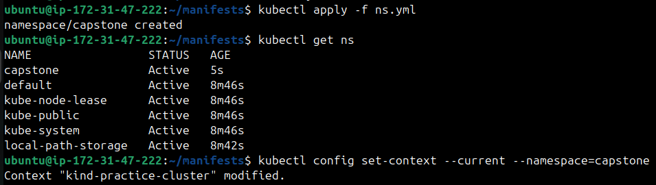

---

## Task 2: Deploy MySQL (Days 54-56)
1. Create a Secret with `MYSQL_ROOT_PASSWORD`, `MYSQL_DATABASE`, `MYSQL_USER`, and `MYSQL_PASSWORD` using `stringData`
2. Create a Headless Service (`clusterIP: None`) for MySQL on port 3306
3. Create a StatefulSet for MySQL with:
   - Image: `mysql:8.0`
   - `envFrom` referencing the Secret
   - Resource requests (cpu: 250m, memory: 512Mi) and limits (cpu: 500m, memory: 1Gi)
   - A `volumeClaimTemplates` section requesting 1Gi of storage, mounted at `/var/lib/mysql`

   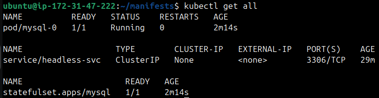

4. Verify MySQL works: `kubectl exec -it mysql-0 -- mysql -u <user> -p<password> -e "SHOW DATABASES;"`

   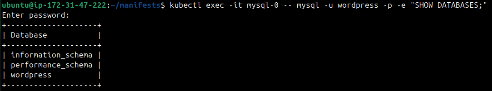

**Verify:** Can you see the `wordpress` database?

---

## Task 3: Deploy WordPress (Days 52, 54, 57)
1. Create a ConfigMap with `WORDPRESS_DB_HOST` set to `mysql-0.mysql.capstone.svc.cluster.local:3306` and `WORDPRESS_DB_NAME`
2. Create a Deployment with 2 replicas using `wordpress:latest` that:
   - Uses `envFrom` for the ConfigMap
   - Uses `secretKeyRef` for `WORDPRESS_DB_USER` and `WORDPRESS_DB_PASSWORD` from the MySQL Secret
   - Has resource requests and limits
   - Has a liveness probe and readiness probe on `/wp-login.php` port 80
3. Wait until both pods show `1/1 Running`

   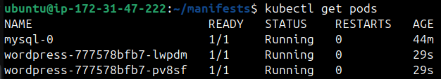

**Verify:** Are both WordPress pods running and ready?

---

## Task 4: Expose WordPress (Day 53)
1. Create a NodePort Service on port 30080 targeting the WordPress pods
2. Access WordPress in your browser:
   - Minikube: `minikube service wordpress -n capstone`
   - Kind: `kubectl port-forward svc/wordpress 8080:80 -n capstone`
3. Complete the setup wizard and create a blog post

   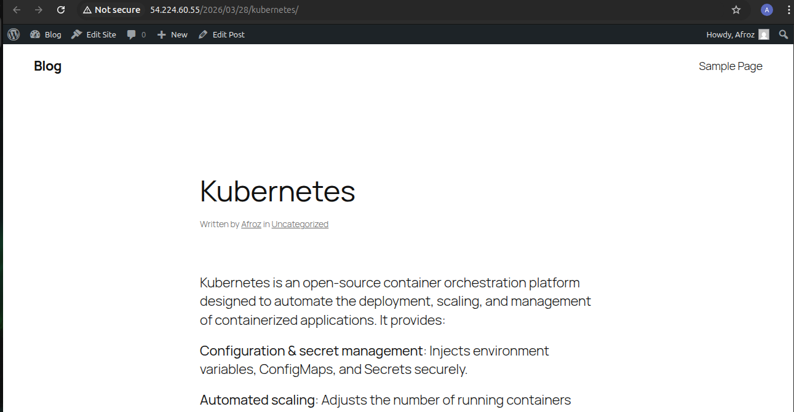

**Verify:** Can you see the WordPress setup page?

---

## Task 5: Test Self-Healing and Persistence
1. Delete a WordPress pod — watch the Deployment recreate it within seconds. Refresh the site.
2. Delete the MySQL pod: `kubectl delete pod mysql-0 -n capstone` — watch the StatefulSet recreate it
3. After MySQL recovers, refresh WordPress — your blog post should still be there

**Verify:** After deleting both pods, is your blog post still there?

   * Pod recreated automatically

   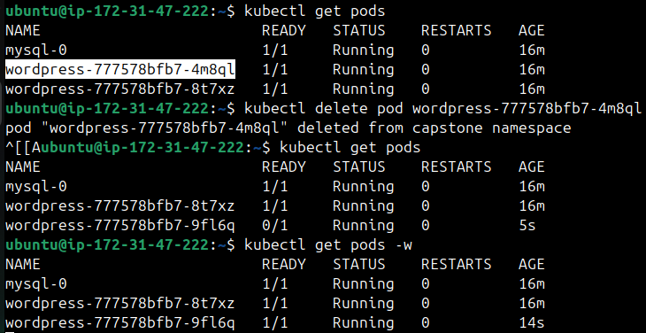

   * After mysql recreated post is still there

   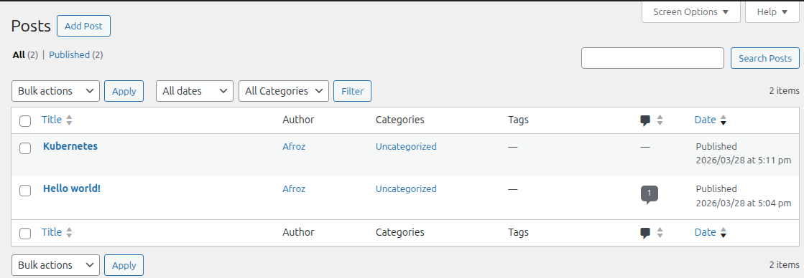

---

## Task 6: Set Up HPA (Day 58)
1. Write an HPA manifest targeting the WordPress Deployment with CPU at 50%, min 2, max 10 replicas
2. Apply and check: `kubectl get hpa -n capstone`
3. Run `kubectl get all -n capstone` for the complete picture

   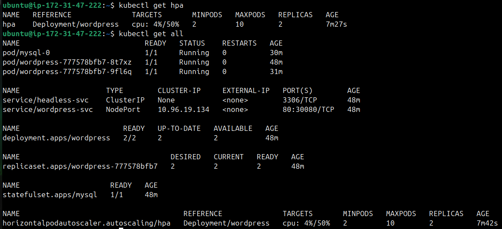

**Verify:** Does the HPA show correct min/max and target?
* **CPU : 4%(min)/50%(max)

---

## Task 7: (Bonus) Compare with Helm (Day 59)
1. Install WordPress using `helm install wp-helm bitnami/wordpress` in a separate namespace

   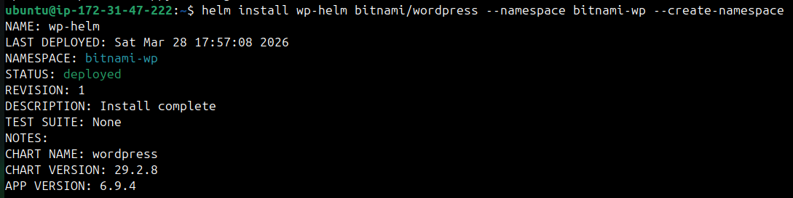

2. Compare: how many resources did each approach create? Which gives more control?

   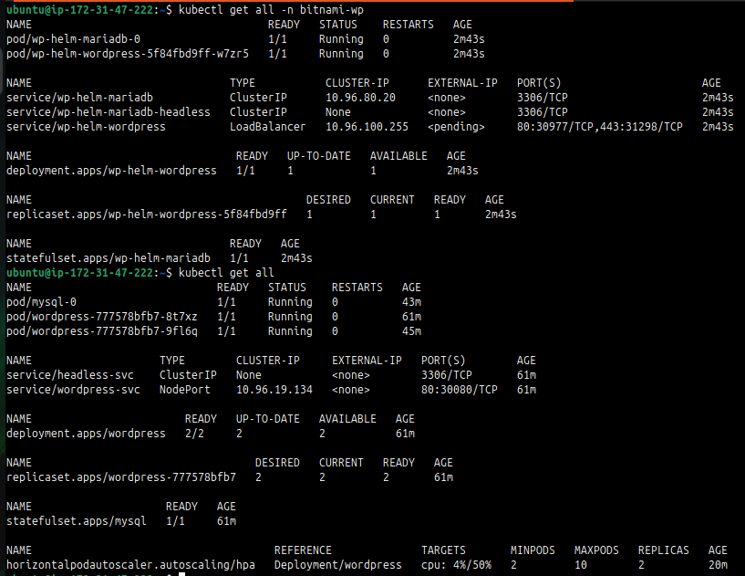

   * **The Difference**

     - Helm created `maria db`, we created `mysql db`.
     - Helm created 2 services for db, one `headless` one `clusterIP`, we created only `headless`.
     - Helm created `1 replica` by default, we created `2`
     - Hel did not create `HPA`, we created `HPA`.
     - Our created deployment gives more control, as we choose evrything.

3. Clean up the Helm deployment

---

## Task 8: Clean Up and Reflect
1. Take a final look: `kubectl get all -n capstone`
2. Count the concepts you used: Namespace, Secret, ConfigMap, PVC, StatefulSet, Headless Service, Deployment, NodePort Service, Resource Limits, Probes, HPA, Helm — twelve concepts in one deployment
3. Delete the namespace: `kubectl delete namespace capstone`
4. Reset default: `kubectl config set-context --current --namespace=default`

   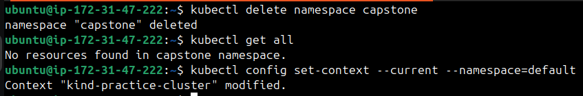

**Verify:** Did deleting the namespace remove everything?
* **yes**

---

- Architecture of your deployment (which resources connect to which)
   * Database Layer

      - Secrets → provide MYSQL_USER and MYSQL_PASSWORD.
      - Headless Service → exposes stable DNS for the StatefulSet.
      - StatefulSet (MySQL) → manages persistent DB pods.
      - Pod mysql-0 → created by the StatefulSet, uses the Secret for credentials.

   * Application Layer

      - ConfigMap → provides WORDPRESS_DB_HOST and WORDPRESS_DB_NAME.
      - NodePort Service → exposes WordPress externally (instance-ip:80).
      - Deployment (WordPress) → manages replicas of the app.
      - Pods (2 replicas) → created by the Deployment, connect to MySQL via DNS.

   * Scaling Layer

      - HorizontalPodAutoscaler (HPA) → monitors CPU usage of the WordPress Deployment.
      - Scales replicas between 2 and 10 based on load.

- Results of self-healing and persistence tests
   * Even if my database pod fails/recreated, the data is persistent.
   * Because of deployment the desired state is maintained and any deleted pod is created again automatically.

- A table mapping each concept to the day you learned it
   
   | Concept | Day |
   |---------|-----|
   | Namespace | 52 |
   | Services | 53 |
   | ConfigMAp, Secrets | 54 |
   | Persistent volumes | 55 |
   | Headless Service | 56 |
   | Probes | 57 |
   | Metrics, HPA | 58 |
   | Helm Charts | 59 |

- Reflection: what was hardest, what clicked, what you would add for production
   * Monitoring
   * TLS/HTTPS
   * RBAC
   * Gateway API

---

