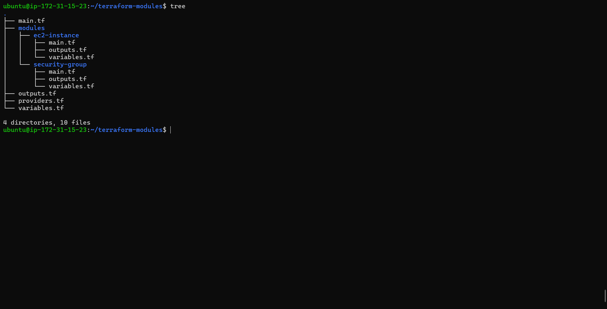

# Day 65 -- Terraform Modules: Build Reusable Infrastructure

## Task

You have been writing everything in one big `main.tf` file. That works for learning, but in real teams you manage dozens of environments with hundreds of resources. Copy-pasting configs across projects is a recipe for disaster.

Today you learn Terraform modules -- the way to package, reuse, and share infrastructure code. Think of modules as functions in programming. Write once, call many times.

---

## All tf files

[terrform files](https://github.com/Mujakkir-Pathan/terraform-terraweak-90day/tree/main/day-5)

---

## All sceenshots

[screenshots of task](screenshots/)

---

## Challenge Tasks

### Task 1: Understand Module Structure

A Terraform module is just a directory with `.tf` files. Created this structure:

```text
terraform-modules/
  main.tf                    # Root module -- calls child modules
  variables.tf               # Root variables
  outputs.tf                 # Root outputs
  providers.tf               # Provider config
  modules/
    ec2-instance/
      main.tf                # EC2 resource definition
      variables.tf           # Module inputs
      outputs.tf             # Module outputs
    security-group/
      main.tf                # Security group resource definition
      variables.tf           # Module inputs
      outputs.tf             # Module outputs
```

Created all the directories and Terraform files.

**Document:** What is the difference between a "root module" and a "child module"?

The **root module** is the main Terraform configuration from which Terraform is run. It contains the main configuration and calls other modules.

A **child module** is a reusable Terraform configuration called by the root module or another module. In this task, `modules/ec2-instance` and `modules/security-group` were child modules.

---

### Task 2: Build a Custom EC2 Module

Created `modules/ec2-instance/`.

1. **`variables.tf`** -- defined inputs:

   - `ami_id` (string)
   - `instance_type` (string, default: `"t2.micro"`)
   - `subnet_id` (string)
   - `security_group_ids` (list of strings)
   - `instance_name` (string)
   - `tags` (map of strings, default: `{}`)

2. **`main.tf`** -- defined the resource:

   - Created `aws_instance` using all the module variables
   - Merged the Name tag with additional tags

3. **`outputs.tf`** -- exposed:

   - `instance_id`
   - `public_ip`
   - `private_ip`

The module was written before applying infrastructure.

Because the AWS account did not have `t2.micro` available, the root module calls were changed to use `t3.micro`.

---

### Task 3: Build a Custom Security Group Module

Created `modules/security-group/`.

1. **`variables.tf`** -- defined inputs:

   - `vpc_id` (string)
   - `sg_name` (string)
   - `ingress_ports` (list of numbers, default: `[22, 80]`)
   - `tags` (map of strings, default: `{}`)

2. **`main.tf`** -- defined the resource:

   - Created `aws_security_group` in the given VPC
   - Used a `dynamic "ingress"` block to create rules from the `ingress_ports` list
   - Allowed all egress

3. **`outputs.tf`** -- exposed:

   - `sg_id`

Used the `dynamic` block to loop over the ingress port list and generate repeated ingress rules.

---

### Task 4: Call Your Modules from Root

In the root `main.tf`, wired everything together.

1. Created a VPC and public subnet directly for the initial custom-module implementation.

2. Called the security group module:

```hcl
module "web_sg" {
  source        = "./modules/security-group"
  vpc_id        = aws_vpc.main.id
  sg_name       = "terraweek-web-sg"
  ingress_ports = [22, 80, 443]
  tags          = local.common_tags
}
```

3. Called the EC2 module twice to deploy two instances with different names using the same module:

```hcl
module "web_server" {
  source             = "./modules/ec2-instance"
  ami_id             = data.aws_ami.amazon_linux.id
  instance_type      = "t3.micro"
  subnet_id          = aws_subnet.public.id
  security_group_ids = [module.web_sg.sg_id]
  instance_name      = "terraweek-web"
  tags               = local.common_tags
}

module "api_server" {
  source             = "./modules/ec2-instance"
  ami_id             = data.aws_ami.amazon_linux.id
  instance_type      = "t3.micro"
  subnet_id          = aws_subnet.public.id
  security_group_ids = [module.web_sg.sg_id]
  instance_name      = "terraweek-api"
  tags               = local.common_tags
}
```

4. Added root outputs that referenced module outputs:

```hcl
output "web_server_ip" {
  value = module.web_server.public_ip
}

output "api_server_ip" {
  value = module.api_server.public_ip
}
```

5. Applied the configuration.

The initial module-based deployment completed successfully:

```text
Apply complete! Resources: 5 added, 0 changed, 0 destroyed.
```

The two EC2 instances used the same security group and had different names. The module state addresses confirmed both EC2 instances were created through the reusable EC2 module.

---

### Task 5: Use a Public Registry Module

Replaced the hand-written VPC resources with the official public VPC module from the Terraform Registry.

The final configuration used the user's `us-east-2` region and variable-driven VPC CIDR:

```hcl
module "vpc" {
  source  = "terraform-aws-modules/vpc/aws"
  version = "~> 5.0"

  name = "terraweek-vpc"
  cidr = var.vpc_cidr

  azs             = ["us-east-2a", "us-east-2b"]
  public_subnets  = ["10.0.1.0/24", "10.0.2.0/24"]
  private_subnets = ["10.0.3.0/24", "10.0.4.0/24"]

  enable_nat_gateway   = false
  enable_dns_hostnames = true

  tags = local.common_tags
}
```

Updated the EC2 and security group module calls to use:

```hcl
module.vpc.vpc_id
```

and:

```hcl
module.vpc.public_subnets[0]
```

Ran `terraform init`, `terraform plan`, and `terraform apply`.

Terraform downloaded version `5.21.0`, which satisfied the constraint `~> 5.0`.

The final plan showed:

```text
Plan: 20 to add, 0 to change, 5 to destroy.
```

The apply completed with:

```text
Apply complete! Resources: 20 added, 0 changed, 5 destroyed.
```

The VPC registry module created the VPC networking resources, including the VPC, subnets, route tables, route associations, internet gateway, and default networking resources.

Compared with the hand-written VPC configuration from Day 62, the registry module created a much larger networking stack. The final state contained 20 managed resources before destruction.

**Document:** Where does Terraform download registry modules to? Check `.terraform/modules/`.

Terraform downloaded the registry module into the local `.terraform/modules/` directory. The VPC module was present at:

```text
.terraform/modules/vpc
```

---

### Task 6: Module Versioning and Best Practices

1. Pin your registry module version explicitly:

   - `version = "5.1.0"` -- exact version
   - `version = "~> 5.0"` -- any 5.x version
   - `version = ">= 5.0, < 6.0"` -- range

Used:

```hcl
version = "~> 5.0"
```

Terraform selected version `5.21.0`.

2. Ran `terraform init -upgrade` to check for newer versions.

Terraform successfully initialized and continued using the selected VPC module version `5.21.0` and AWS provider version `6.62.0`.

3. Checked the state to see how modules appear:

```bash
terraform state list
```

The state showed module prefixes such as:

```text
module.vpc.*
module.web_server.*
module.api_server.*
module.web_sg.*
```

Examples included:

```text
module.api_server.aws_instance.this
module.web_server.aws_instance.this
module.web_sg.aws_security_group.this
module.vpc.aws_vpc.this[0]
```

4. Destroyed everything:

```bash
terraform destroy
```

The destroy completed successfully:

```text
Destroy complete! Resources: 20 destroyed.
```

A final `terraform state list` returned no resources, confirming that the Terraform state was empty after cleanup.

**Document:** Write down five module best practices:

- Always pin versions for registry modules
- Keep modules focused -- one concern per module
- Use variables for everything, hardcode nothing
- Always define outputs so callers can reference resources
- Add a README.md to every custom module

---

### custom module structure (directory tree)



### Comparison: Hand-written VPC vs Registry VPC Module

| Configuration | Resources Created |
|---|---:|
| Day 62 — Hand-written VPC | 5 |
| Day 65 — Registry VPC Module | 20 |

The hand-written VPC from Day 62 created only the basic networking resources we needed, while the official VPC registry module created a much more complete VPC setup.

The registry module created **20 resources**, which is **15 more resources** than our hand-written VPC.

This included things like multiple public and private subnets, route tables, route table associations, an Internet Gateway, and other default networking resources.

The main takeaway for me was that using a module doesn't just reduce the amount of Terraform code I have to write. It also lets me reuse a well-tested infrastructure pattern instead of building and maintaining every networking component myself.

---
